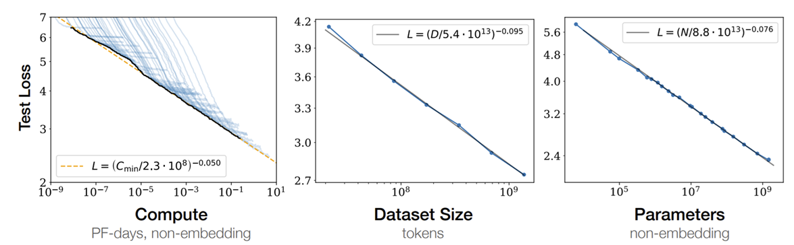
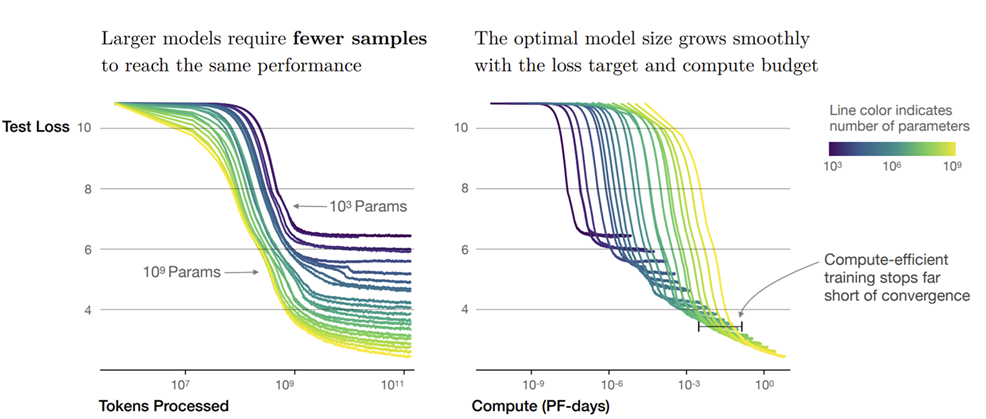

<!--Copyright © ZOMI 适用于[License](https://github.com/Infrasys-AI/AIInfra)版权许可-->

# 预训练Scaling Law

预训练阶段的Scaling Law（缩放定律）主要关注如何提升模型的知识容量。

哪些因素影响大语言模型的知识容量和性能，决定着我们需要在预训练过程中在什么方面进行投入；而这些因素如何影响模型性能，则决定着预训练需要投入多少资源。本节将以 [Scaling Laws for Neural Language Models](https://arxiv.org/pdf/2001.08361) 这篇论文为主，辅以其他研究成果，介绍影响大语言模型预训练效果的重要因素。

模型规模
数据集规模
训练所用计算资源
Batch Size 
学习率
模型结构
上下文长度
数据域外分布
优化器

Scaling law 要同时 scale up 模型、数据和算力。

大家远远低估了 scaling law 中数据的重要性。比如 GPT-3 刚出来的时候，用了千亿参数，但只配了几百 B 的数据。按今天的观点来看是完全倒置，当时模型都是训练严重不足的状态。这两个原因导致 2021 年大家复现 GPT3 都没有做出特别好的效果。

## 什么是大型语言模型缩放定律

“缩放定律”是指神经网络性能随关键因素（如模型参数数量、训练数据集大小和计算成本）变化而呈现出的经验性、可预测的规律。这些定律揭示了在增加计算资源时，模型性能（通常以交叉熵损失衡量）如何以幂律形式平滑且可预测地改善 。

在预训练阶段，模型性能的核心衡量指标是交叉熵损失。交叉熵损失量化了模型预测与真实标签之间的差异，其数值越低，表示模型预测的准确性越高，性能越好。

缩放定律能够预测模型在不同资源投入下的性能表现，从而为研究人员和工程师提供高效的超参数选择、模型设计和计算资源分配的指导 。

## 基础：Kaplan et al. (2020) 的开创性研究

### 核心发现：模型参数、数据集和计算量的幂律关系

Kaplan et al.于2020年发表的论文[Scaling Laws for Neural Language Models](https://arxiv.org/pdf/2001.08361)是LLM缩放定律领域的奠基性工作。该研究首次系统性地揭示了语言模型性能与模型规模、数据集大小和计算量之间的精确幂律关系。

该研究的三大核心发现如下：

**模型规模 (N) 与损失**：  
语言模型性能随非嵌入参数数量$N$的增加而平滑提升，  
$$
L(N) \approx \left( \frac{N_c}{N} \right)^{\alpha_N}
$$  
其中，$\alpha_N \approx 0.076$，这意味着模型参数数量翻倍，交叉熵损失会减少约5%。

**数据集大小 (D) 与损失**：  
性能随数据集大小$D$（以token计）的增加而平滑提升， 
$$
L(D) \approx \left( \frac{D_c}{D} \right)^{\alpha_D}
$$  
其中，$\alpha_D \approx 0.095$。

**计算量 (C) 与损失**：  
性能随优化分配的训练计算量$C_{\text{min}}$的增加而平滑提升，  
$$
L(C_{\text{min}}) \approx \left( \frac{C_c^{\text{min}}}{C_{\text{min}}}} \right)^{\alpha_C^{\text{min}}}
$$  
其中，$\alpha_C^{\text{min}} \approx 0.050$。

## 发展与演进：Chinchilla的缩放定律

针对Kaplan et al.的发现，后续研究（如DeepMind的Chinchilla论文）提出了对最优计算分配策略的修正。Chinchilla的核心发现是，对于给定的计算预算，模型参数和数据集应以大致相等的比例缩放，而非Kaplan et al.建议的侧重N 。

