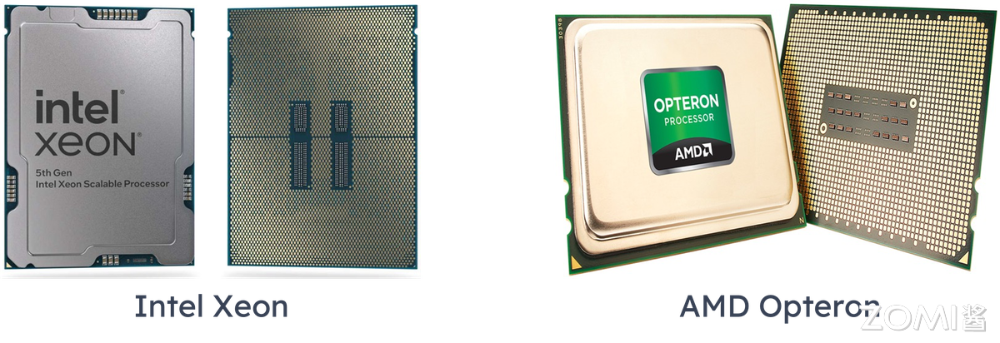
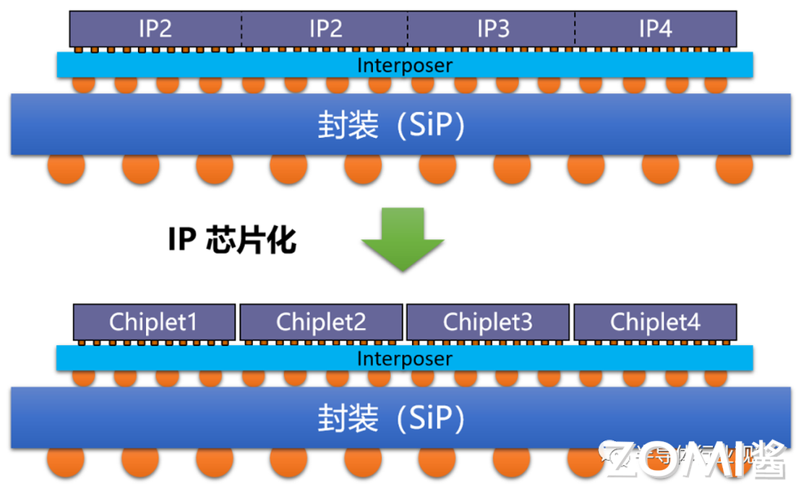
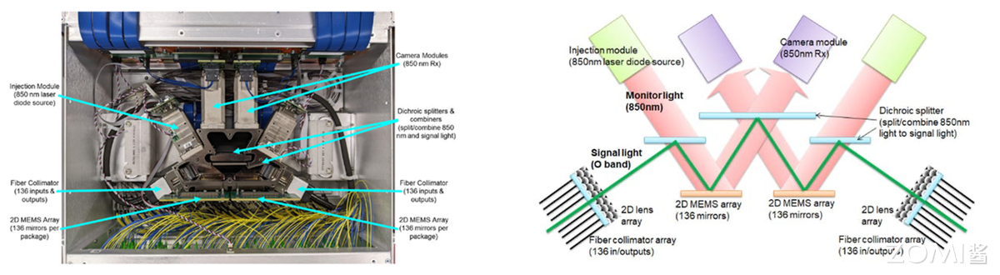
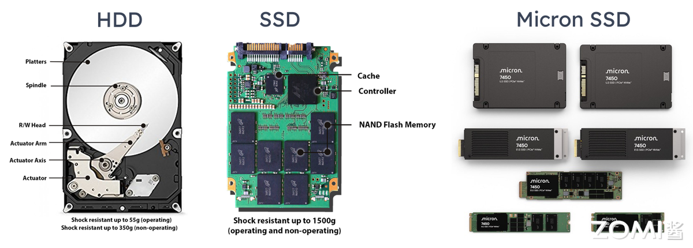
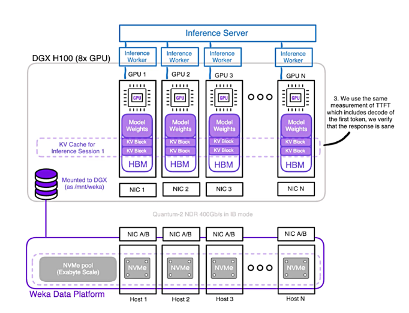

<!--Copyright © ZOMI 适用于[License](https://github.com/Infrasys-AI/AIInfra)版权许可-->

# HPC 硬件发展趋势

Author by: 陈悦孜

承接上文我们介绍了高性能计算和集群的定义，这章我们介绍高性能计算发展的趋势。我们将从核心硬件、基础软件和应用软件三个维度来分析高性能计算发展的趋势。

高性能计算硬件发展历程和未来趋势从高性能网络、处理器、服务器、存储器四个核心维度展开分析。其演进逻辑始终围绕性能突破、能效优化与场景适配展开：

- 高性能处理器：从通用多核到异构计算。
- 高性能网络：从低延迟到高带宽互联。
- 高性能存储器：从容量扩展到存算协同。
- 高性能服务器：从单机性能到绿色化集群。

## 高性能处理器

### CPU 主导时代

早期高性能计算依赖于并行 CPU 集群，比如 Intel Xeon, AMD Opteron 系列，通过提升主频、增加核心数量（多核/众核）和优化指令集实现性能增长。

Intel Xeon系列自 1998 年诞生起专注服务器市场，早期通过 Pentium Pro 微架构奠定基础（超纯量、超管线设计），2006 年后以 Merom 微架构统一服务器与桌面产品线，提升能耗比。而 2003 年推出的 AMD Opteron 系列（K8 架构）首次集成内存控制器，采用 HyperTransport 总线，支持低成本 64 位计算并兼容 32 位软件，颠覆了 RISC 服务器的垄断地位。

AMD Opteron系列第五代至强（Emerald Rapids）支持单 CPU 64 核心，三级缓存容量扩大近 3 倍，通过 DDR5 内存和 UPI 2.0 互连提升并行吞吐量，AI 推理性能提升 42%。2010 年代 Opteron 6100 系列推出 12 核型号（如 6180 SE），在 2.5GHz 主频下实现高密度计算（如戴尔 PowerEdge C6145 服务器支持单机柜 96 核）。

#### 主频提升达瓶颈

2000 年代初，Intel Prescott 核心尝试通过 90nm 工艺提升主频，但功耗突破 100W，导致“高频低效”问题，最终转向多核架构随着工艺微缩接近物理极限，单核主频停滞在 3-4GHz 范围，性能增长转而依赖多核并行和指令级并行（ILP）优化。

早期代表性 HPC CPU 参数对比

|系列|代表型号|	发布时间|核心数|主频|关键技术特点 |
|-|-|-|-|-|-|
AMD Opteron|	Opteron 6180 SE	|2010|	12|	2.5GHz|	集成内存控制器，HyperTransport 总线|
Intel Xeon|	Xeon E5-2600 v4	|2016|	22|	2.2GHz|	超线程，AVX2 指令集|
AMD Opteron|	Opteron 6166 HE|	2010|	12	|1.8GHz|	低功耗设计（65W）|
Intel Xeon	|Xeon Platinum 8380	|2021|	40|	2.3GHz|	支持 PCIe 4.0，8 通道 DDR4|

#### 协处理器兴起

协处理器是一种辅助处理器，设计用于与主 CPU 协同工作，专门处理特定类型的任务以提高系统整体性能。协处理器是计算机系统中与主处理器（CPU）配合工作的专用处理单元，它能够分担 CPU 的特定计算任务、提高特定类型运算的效率，并且优化系统整体性能。

协处理器可用于专用加速，比如 Intel Xeon Phi（MIC 架构，2012-2020）尝试众核路线。以下为 Phi 初期型号及其参数。

型号|	核心数|	浮点性能|	内存容量|	内存带宽|	TDP|	售价|
|-|-|-|-|-|-|-|
Phi 3100|	57|	1 TFlops|	6 GB|	240 GB/s|	300W	|<=$2,000|
Phi 5110P|	60|	1.01 TFlops|	8 GB|	320 GB/s|	225W|	$2,649|
Phi 7120|	61|	1.2 TFlops|	16 GB|	352 GB/s	|300W|	$4,129|

​​GPU 加速​​也属于协处理器范畴，NV CUDA 革命性地将 GPU 用于通用计算， Tesla 成为通用并行计算标杆。首代 Tesla 架构（如 G80）引入统一着色器设计，将矢量计算单元拆分为标量核心（CUDA Core），支持 C 语言编程，实现 SIMT（单指令多线程）执行模型，奠定通用计算基础，将 GPU 从图形协处理器升级为通用计算引擎，定义“CPU+GPU”异构标准。

#### 国产 CPU 突破

中国自主研发的申威 SW26010 处理器，凭借其创新的异构众核架构（包含 256 个高性能计算核心和 1 个管理核心），实现了单芯片高达每秒 3 万亿次（3 TFlops）的峰值浮点计算能力。这一突破性设计，成为支撑中国首台、也是世界首批 E 级（Exascale， 百亿亿次）超级计算机——“神威·太湖之光”的核心动力源泉。

尤为关键的是，申威 SW26010 采用了完全独立自主的申威指令集架构（SW ISA），彻底摆脱了对国外主流指令集的依赖，确保了核心技术自主可控的安全性与战略意义。

搭载了超过 40,000 颗申威 SW26010 处理器的“神威·太湖之光”超级计算机，于 2016 年 6 月在全球超级计算机 TOP500 排行榜上震撼登顶，终结了美国超算长达 23 年的榜首垄断地位。它不仅以 93 PFlops（每秒 9.3 亿亿次）的 Linpack 实测持续性能创造了当时的世界纪录，更是全球首台突破 10 亿亿次/秒（100 PFlops）大关的超级计算机，标志着人类正式迈入百亿亿次计算时代（E 级超算时代） 的门槛。

#### Arm 高性能计算突破

NVIDIA Grace CPU 实现内存子系统革新。​​LPDDR5X 和纠错码​​的设计使得能效提升 2 倍；CPU-GPU 一致性缓存的机制和​NVLink-C2C 直连使​​延迟降至 1/10。
鲲鹏 920ARM-based 处理器采用 7nm 工艺，ARM 架构授权，华为自主设计。通过优化分支预测算法、提升运算单元数量、改进内存子系统架构等一系列微架构设计，提高处性能。

以下表格对比传统 Arm（移动端）和高性能计算优化版（服务器级）的架构对比。

|特性 | 传统Arm（移动端）|HPC优化版（服务器级）|
|-|-|-|
|指令集|精简指令集（RISC）|拓展SIMD之路（SVE/SVE2）|
|核心规模|多核低频（能效优先）|512核以上众核架构（Fujitsu A64FX）|
|内存系统|低带宽LPDDR|HBM2e（>1TB/s带宽）|
|功耗管理|动态调频（DVFS）|精细功耗门控（Per-core PowerGating）|

### 处理器发展趋势

GPU 主导加速市场，国产力量野蛮生长​。NVIDIA H100/AMD MI300X 成为 AI/HPC 核心算力，国产替代（e.g. 寒武纪、华为昇腾）加速发展。

​​Chiplet 技术​​和存算一体技术加速异构多样化。

#### Chiplet技术

AI技术蓬勃发展，数据中心对高算力芯片需求技术增长，算力芯片与传统消费级芯片相比，算力芯片面积更大，存储容量更大，对互连速度要求更高，Chiplet技术可以很好的满足这些大规模芯片的性能和成本需求，因而得到广泛运用。

Chiplet是一种先进的芯片设计和制造方法。Chiplet 即小芯粒，它将一类满足特定功能的die（裸片），通过die-to-die
内部互联技术将多个模块芯片与底层基础芯片封装在一起，形成一个系统芯片。 

它不再像传统方式那样把包含处理器核心、内存控制器、I/O 接口等所有功能都集成在一个巨大的单片硅芯片（Monolithic Die）上，而是将复杂的大芯片拆分成多个更小、功能更单一、工艺更优化的独立小芯片（Chiplet）。这些小芯片（例如：CPU 核心、GPU 核心、高速缓存、I/O 模块）各自可以采用最适合其功能和成本的半导体工艺（如逻辑用先进工艺，I/O 用成熟工艺）独立制造。然后，它们通过高速、高密度的先进封装技术（如硅中介层、EMIB、CoWoS 等）像“搭乐高”一样集成封装在一个基板上，形成一个功能完整的系统级芯片（SoC）。

这种技术提高良率、降低制造成本（尤其是先进工艺成本）、设计更灵活（可复用成熟 Chiplet）、加速产品上市、实现异构集成（不同工艺、不同厂商的 Chiplet 组合）。AMD、Intel 通过多芯片封装提升集成度和良率（比如 Intel Ponte Vecchio 含 47 颗 Chiplet）。

#### 存算一体

算力的需求急速发展使得业界也通过变革当前计算架构来实现算力突破。主流芯片的冯诺依曼结构设计将季赛和存储分离，二者配合完成数据存取与运算。但是由于处理器的设计以提升计算速度为主，存储则更注重容量提升和成本优化，“存”“算”之间性能失配，从而导致了访存带宽低、时延长、功耗高等问题，即通常所说的“存储墙”和“功耗墙”访存愈密集，“墙”的问题愈严重算力提升愈困难。

由此，存算一体的技术应运而生。它的技术核心是将存储与计算完全融合，有效克服冯·诺依曼架构瓶颈，并结合后摩尔时代先进封装、新型存储器件等技术，实现计算能效的数量级提升。

存算技术（Computing-in-Memory / Near-Memory Computing）是一种旨在突破传统计算机“冯·诺依曼瓶颈”的革命性架构。目前学术界和工业界均在开展存算一体技术研究，学术界主要关注狭义的存算一体，即利用存储介质进行计算；工业界关注商用化进程，着重宣传广义存算一体概念，但分类方法尚未完全统一。本章节将对广义存算一体技术进行分类，望达成广泛共识。

根据存储与计算的距离远近，我们将广义存算一体的技术方案分为三大类，分别是近存计算(ProcessingNear Memory,PNM)、存内处理(Processing In Memory, PlM)和存内计算(Computing in Memory, ClM)。存内计算即狭义的存算一体。

- 近存计算通过芯片封装和板卡组装等方式，将存储单元和计算单元集成，增加访存带宽、减少数据搬移，提升整体计算效率。近存计算仍是存算分离架构，本质上计算操作由位于存储外部、独立的计算单元完成其技术成熟度较高，主要包括存储上移、计算下移两种方式。

- 存内处理是在芯片制造的过程中，将存和算集成在同一个晶粒(Die)中，使存储器本身具备了一定算的能力。存内处理本质上仍是存算分离相比于近存计算，“存”与“算”距离更近。当前存内处理方案大多在内存(DRAM)芯片中实现部分数据处理，在DRAM Die中内置处理单元，提供大吞吐低延迟片上处理能力，可应用于语音识别、数据库索引搜索、基因匹配等场景。

- 存内计算即狭义的存算一体在芯片设计过程中，不再区分存储单元和计算单元，真正实现存算融合。存内计算是计算新范式的研究热点，其本质是利用不同存储介质的物理特性，对存储电路进行重新设计使其同时具备计算和存储能力，直接消除“存”"算个界限，使计算能效达到数量级提升的目标。

存算技术这种技术大幅减少数据搬运，从而显著提升能效比（数十倍甚至百倍） 和计算速度，特别适用于数据密集型的 AI 推理/训练、大数据分析等场景。台积电 3D Fabric 技术将计算单元堆叠至存储层（比如 CXL 协议设备），突破冯·诺依曼瓶颈。

## 高性能网络

### 网络发展历程：早期阶段 (1990s-2000s)

一方面以太网主导网络应用领域。千兆以太网（GigE）成本低被广泛采用，但延迟高（>100μs）、带宽瓶颈明显。千兆以太网是 IEEE 802.3ab/z 标准定义的以太网技术，传输速率达 1 Gbps（1000 Mbps），是传统百兆以太网（100 Mbps）的 10 倍。它延续了以太网的帧结构（如 MAC 地址、CSMA/CD 机制）和基础设施（双绞线、光纤）。它具有低成本与高兼容性的优点，同时有广泛应用场景。使用广泛普及的 Cat 5e/6 双绞线（百米内无需中继）或光纤，布线成本低。兼容现有网络设备（交换机、路由器），支持平滑升级。它是企业局域网（LAN）、家庭宽带、工业控制、IP 监控摄像头等领域的主流选择，同时因成熟稳定，成为中低速设备的默认网络接口（如打印机、IoT 设备）。

另一方面大量的专有网络兴起。Myrinet、Quadrics 等私有协议网络出现，延迟~10μs，但生态封闭制约普及。专有网络，如 Myrinet 和 Quadrics，是高性能计算领域为突破传统以太网性能瓶颈而兴起的私有协议互连技术。其核心优势在于实现了~10 微秒级的极低通信延迟和高吞吐量，这得益于其精简的协议栈（绕过操作系统内核直接在网卡硬件处理通信）和定制的交换架构。然而，这些技术的生态高度封闭成为其致命短板：它们依赖专属的硬件（特定网卡、交换机）和私有软件栈（如专用通信库），导致成本高昂（远超商用以太网）、兼容性差、用户被厂商锁定且不同系统间互操作性困难。最终，这种封闭性严重制约了其普及和发展，在 2009 年前后，它们被更具开放性和成本效益的技术（如 InfiniBand 和基于以太网的 RDMA）所取代而退出主流市场。

### 网络发展历程：主流技术成型（2010s 至今）

这里介绍主流技术有 InfiniBand、RoCE 和 NVLink。

- InfiniBand 由 Mellanox 主导，采用 RDMA 实现微秒级延迟和百 GB/s 带宽，成为 HPC 主流。InfiniBand是由 Mellanox（现属 NVIDIA）主导推动的开放标准高性能网络，与封闭的专有网络（如 Myrinet/Quadrics）形成鲜明对比。它通过 RDMA（远程直接内存访问） 技术彻底绕开操作系统协议栈，实现 微秒级超低延迟（可低于 1μs）和 超高带宽（当前达 400Gbps，约 50GB/s），完美匹配 HPC 与 AI 算力需求。其核心优势在于开放生态，由国际组织 IBTA 统一标准，兼容多厂商设备（网卡、交换机），同时支持与以太网融合（如 RoCE 协议）。凭借性能与通用性的平衡，InfiniBand 自 2010 年代起取代旧式专有网络，成为超算中心（如 Summit、Sierra）和云数据中心的主流互连方案。

- RoCE 是基于以太网 RDMA 的技术，兼顾低成本与高性能，是华为、阿里云等国产厂商加速布局的重要方向。RoCE 是一种在标准以太网上实现 RDMA（远程直接内存访问）的高性能网络技术，由 InfiniBand 贸易协会（IBTA）制定开放标准。它通过绕过操作系统内核协议栈，使数据直接从应用内存访问网卡，实现微秒级延迟（典型值 10-20μs） 和高吞吐量（可达 400Gbps），逼近 InfiniBand 性能。其核心价值在于兼顾高性能与低成本：复用现有以太网交换机和布线设施（需支持无损特性如 PFC/ECN），大幅降低部署门槛。正因这一优势，华为（含其 CE 系列交换机）、阿里云、腾讯云等中国厂商积极布局 RoCEv2 协议，推动其在云数据中心、AI 训练集群及存储网络（如 NVMe-oF）中的规模化应用，成为突破 InfiniBand 生态垄断的关键国产化路径。

- NVLink 是 NV 专为 GPU 互联设计高速总线，用于节点内多卡互联，演进 NV Fusion。NVLink 是 NVIDIA 专为 GPU 高性能互联设计的私有高速总线协议，核心目标是解决节点内多 GPU 卡间的通信瓶颈。它通过点对点直连架构（替代传统 PCIe 总线），实现远超 PCIe 的带宽（第四代达 900GB/s） 和纳秒级延迟，显著加速 GPU 间数据交换（如 AI 训练中的梯度同步）。

### 高性能网络发展趋势：低延迟与融合​

在人工智能（AI）、高性能计算（HPC）和超大规模数据中心蓬勃发展的浪潮下，网络性能，尤其是低延迟和高带宽，已成为制约整体系统效能的关键瓶颈。同时，不同技术路径的融合趋势日益明显，共同推动网络基础设施向更高性能、更智能、更灵活的方向演进。核心发展趋势聚焦于以下几个方面。

- InfiniBand持续领先超低延迟领域​​。InfiniBand (IB) 凭借其原生设计的超低延迟、高吞吐量、无损传输和强大的远程直接内存访问 (RDMA) 能力，长期以来是HPC和AI训练集群的首选互联技术。代表当前IB发展巅峰的NVIDIA Quantum-2 支持 400Gb/s 单端口带宽，显著提升了节点间通信效率，NDR 1.6Tb/s超高速率将满足未来千卡、万卡级AI训练集群对极致带宽的需求。

- RoCE v2与智能网卡 (DPU/IPU) 重塑高性能以太网​​。借助 DPU/IPU 降低 CPU 负载，提升以太网竞争力。基于融合以太网的 RDMA (RoCE v2) 技术通过在标准以太网上实现类似IB的RDMA能力，大大提升了以太网的性能和效率，使其在高性能网络领域具备了强大的竞争力。智能网卡比如数据处理器 (DPU) 或基础设施处理器 (IPU)这些专用硬件将网络、存储和安全功能从主机CPU卸载下来，通过处理网络协议栈（尤其是RoCE的拥塞控制、流量管理）、虚拟化、存储加速（NVMe-oF）、安全加密等技术，释放宝贵的CPU核心用于运行应用。智能网卡提供硬件级RDMA加速，显著降低延迟，提升带宽利用率，使以太网接近IB的性能水平。

- ​光互连技术突破铜缆限制，奠定下一代网络基石​​。随着速率演进，传统铜缆在距离、功耗、密度和信号完整性方面面临严峻挑战。光互连是突破这些瓶颈的可行方案。硅光集成、CPO（共封装光学）、 OCS（光学链路开关）成为下一代网络关键。硅光集成 (Silicon Photonics)利用成熟的硅基半导体工艺制造光学器件（调制器、探测器、波导等），实现高集成度、低成本、低功耗的光模块/芯片，是规模化应用的关键。共封装光学 (CPO - Co-Packaged Optics)将光引擎与交换机芯片/ASIC共同封装在同一基板上（而非传统可插拔模块）。这大大缩短了电信号传输距离，显著降低功耗（~30-50%），提升带宽密度和信号质量，是800G/1.6T及更高速率的主流解决方案。光学链路开关 (OCS - Optical Circuit Switch)利用光开关技术直接在光层动态配置连接路径（无需经过电交换芯片）。特别适用于超大规模数据中心中计算、存储资源池间的极低延迟、高带宽、可重构的互连（如用于分解式存储/内存、大规模AI训练集群的All-to-All通信），能效比极高。

- 新互联协议面向异构计算与AI的专用优化。华为灵渠总线互联，实现 CPU2NPU、NPU2NPU 新一代的集群互联。传统的CPU间互联协议（如PCIe）在连接CPU与加速器（如GPU、NPU）或加速器之间的高效通信时，存在延迟、带宽和扩展性瓶颈，对于CPU与加速器或者加速器提速通信的需求，新互联协议成为新一代的集群互联技术。华为灵渠总线互联是一个典型的代表，是专门为 CPU-to-NPU 和 NPU-to-NPU 通信设计的新一代集群互联技术。它提供超高带宽、超低延迟的直接连接，显著优化大规模AI训练和推理集群中，异构计算单元（特别是海量NPU间）的数据交换效率。这类协议代表了网络技术与特定计算架构（如AI集群）的深度融合，通过硬件和协议层的协同设计，最大化整体计算效能。随着异构计算（CPU+GPU+NPU+其他加速器）成为主流，针对特定场景（尤其是AI）优化的专用高速互联协议将成为高性能网络发展的重要分支，与IB、以太网（RoCE）形成互补或竞争关系。

## 高性能存储

### 发展历程1：硬盘时代

SSD 取代 HDD 提升 I/O 速度引发的硬盘革命。

HDD（普通硬盘）通过涂有磁性材料的旋转磁盘（盘片）来存储数据。它们的机械臂上具有读/写头，通过在这些旋转磁盘上来回移动来访问数据。由于机械构造上的局限性，传统HDD的运行速度比较慢。它们的数据传输速率较低，且延迟较高。由于HDD包含活动部件（旋转磁盘和机械臂），因此更容易出现机械故障。与SSD相比，HDD通常可提供更大的存储容量，而且每GB成本更低。希捷、西数推出 HDD，受限于输入输出延迟（ms 级），难满足高性能计算的需求。

SSD（固态硬盘）是硬盘技术后起之秀，相比HDD具有明显的性能优势，因而广受欢迎。SSD使用基于半导体的非易失性闪存，利用硅芯片的物理和化学特性来提供更大的存储容量，能够加快数据访问和传输速度。在读取速度，耐用性和能效上和HDD比都有明显的优势。速度上SSD 比 HDD 快得多，启动速度和文件传输速度都更快，并且可缩短应用程序的加载时间。耐用性更高，由于 SSD 没有活动部件，因此它们更加耐用，不容易因为遭到冲击或跌落，而造成物理损坏和数据丢失。SSD 的功耗比 HDD 低，因此适合在笔记本电脑和移动设备中使用，这些设备的电池续航时间至关重要。三星 PM1733（30TB）顺序读写达 7GB/s，延迟降至 50μs。

### 发展历程2：分布式存储和新存储文件系统

#### 分布式文件系统

分布式文件系统（Distributed File System，DFS）是指文件系统管理的物理存储资源不一定直接连接在本地节点上，而是通过计算机网络与节点（可简单的理解为一台计算机）相连；或是若干不同的逻辑磁盘分区或卷标组合在一起而形成的完整的有层次的文件系统。DFS为分布在网络上任意位置的资源提供一个逻辑上的树形文件系统结构，从而使用户访问分布在网络上的共享文件更加简便。Lustre、Ceph 等文件系统支撑EB级数据吞吐，比如Lustre带宽突破 1TB/s。

#### AI 驱动存储优化 ：WekaIO、VAST Data通过NVMe-oF + RDMA实现全闪存存储集群。

随着LLM的爆火，在训练和推理层面都对Infra提出新挑战，传统深度学习时代模型规模较小，猝存储上面临的都是小文件问题，对性能没有太多需求，而LLM动辄100B的参数量，在数据管道的各个阶段需要花费大量时间在不同系统之间复制数据，对GPU利用率较低的现象有很大影响，所以AI存储技术需要有新的进展。

全闪文件系统（All-Flash File System）是专门为全闪存（All-Flash）存储阵列设计的文件系统，这种存储阵列完全由固态驱动器（SSD）组成，而不是传统的机械硬盘（HDD）。与传统的文件系统相比，全闪文件系统针对固态驱动器的特性进行了优化，以提高性能和效率，延长固态驱动器的使用寿命。

全闪方案通过NVMe-OF和RDMA实现存储集群。NVMe规范是从零开始专为SSD而设计的规范，而NVMe-oF支持创建超高性能存储网络，其时延能够比肩直接连接的存储器。因而可在服务器之间按需共享快速存储设备。NVMe-oF可视为基于光纤通道的SCSI或iSCSI的替代品，其优势在于时延更低、I/O 速率更高，且生产力更优。NVMe-OF+RDMA采用不中断远程机器系统 CPU 处理的情况下直接存取内存的技术实现AI高性能存储，NVMe over RDMA可以根据RDMA本身支持的协议而分为多个RDMA Transport（InfiniBand（IB），RDMA over Converged Ethernet（RoCE）和internet Wide Area RDMA Protocol（iWARP））来实现数据存取。

需要注意的是，全闪方案基本没有开源方案，全部都是商业公司的支持，有些还需要购买专门的硬件，或者需要在公有云依赖特定的硬件支持。目前比较火的是weka.io和VAST，国内的云厂商都有提供对应的解决方案，比如阿里云的CPFS以及百度云的PFS等。开源的目前发现有 Intel 的 DAOS。

如图展示weakIO全闪存储集群，它是一个8节点的WEKApod，具有PCIe Gen 5连接，通过Nvidia的Quantum-2 QM9700 64端口400 Gbps InfiniBand交换机连接到Nvidia DGX H100服务器。

### 高性能存储发展历程3： 新存储技术革命
#### SCM（存储级内存）：Intel Optane 持久内存试图弥合内存与存储间的性能鸿沟。
#### HBM（高带宽内存）：NPU/GPU 高度集成与依赖， HBM3 每引脚数据速率提高到 6.4Gb/s，单设备带宽 819GB/s 。

### 高性能存储：近计算与层级优化
1. 存储级内存 SCM：CXL 3.0 协议推动存储池化，实现 CPU/GPU 共享内存资源。
2. HBM3e 与 HBM4​​：2025 年 HBM3 带宽突破 1TB/s，成 AI 芯片标配。
3. 存算一体架构：计算单元嵌入存储层，减少数据搬运。
4. 存算一体器件：忆阻器 Memristor、相变存储器 PCM 支持内存计算，降低搬运功耗。

>>>>>>>>>>>>>>>>>>>
还没写完！

## 本节视频

<html>
<iframe src="https://player.bilibili.com/player.html?isOutside=true&aid=114767700172746&bvid=BV16A3wzEELU&cid=30765482532&p=1&as_wide=1&high_quality=1&danmaku=0&t=30&autoplay=0" width="100%" height="500" scrolling="no" border="0" frameborder="no" framespacing="0" allowfullscreen="true"> </iframe>
</html>

## reference
https://www.witintech.com/upfiles/202312051029031006456460.pdf
https://pdf.dfcfw.com/pdf/H3_AP202307091592122354_1.pdf 
https://www.dell.com/support/contents/zh-cn/article/product-support/self-support-knowledgebase/data-storage-backup-and-recovery/support-for-hard-disk-drive
https://aws.amazon.com/cn/compare/the-difference-between-ssd-hard-drive/
