<!--Copyright © ZOMI 适用于[License](https://github.com/Infrasys-AI/AIInfra)版权许可-->

# HPC 软件与应用发展趋势

Author by: 陈悦孜

第二章简要介绍了高性能计算的硬件内容后，在这里的第三章我们介绍高性能计算软件与应用发展趋势。

高性能基础软件发展历程和未来趋势部分的内容将介绍编译器与运行时、计算库、通信中间件、存储系统、调度系统五个部分的子内容。对于应用软件，我们会介绍整体发展历程和具体行业应用趋势。

## 基础软件

高性能计算基础软件是连接硬件与应用的核心桥梁。基础软件发展历程围绕资源高效调度、数据高速流动、计算极致优化这些目标展开，主要分为调度、存储、通信、编译、计算库及基础算法六大维度。

## 编译器与运行时：从手动优化到自动代码生成

### 发展历程：传统编译器（1980s-2000s）

#### Fortran 主导 ：Intel Fortran Compiler、PGI Compiler 通过向量化和循环展开提升性能

Fortran诞生于20世纪50年代，由约翰·巴科斯（John W. Backus）及其团队提出，用于替代用户使用的汇编语言，帮助用户使用高级编程语言，并使其能达到接近手工编码汇编语言的性能，大大简化用户编程量。

图为巴科斯和Fortran。

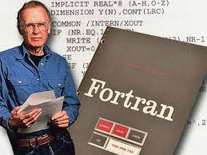

Fortran发展到后期，有很多公司基于Fortran也推出了自己的Fortran编译器产品。

Intel Fortran编译器是英特尔开发的编译器，有支持Windows系统和Linux系统版本。Windows系统版本的Intel Fortran是英特尔公司从惠普买来的在Windows平台从CVF 6.6.C之后Fortran编译器相关权利后开发的，在微软Visual Studio外壳的支持下实现Visual IDE功能。CVF代表Compact Visual Fortran，是一种紧凑型的视觉编程工具或接口的技术。Intel Fortran编译器也有支持Linux的版本。Intel Fortran 编译器是 Intel Math Kernel Library 的一部分，专为 Intel 处理器优化。它提供了高性能的编译和调试工具，能够生成高效的机器代码，尤其在处理大规模数值计算时表现优异。

PGI编译器是Portland Group提供的 Fortran 编译器。Portland Group (也称作 PGI ) 是领先的软件供应商，提供用于并行运算的编译器与工具。PGI 编译器为 Intel 和 AMD 64-位 x86 CPU 进行大幅度优化，并提供针对 NVIDIA GPU Accelerator的广泛支持与优化。其中用到的PGI Unified Binary 技术确保利用 PGI 编译器构建而成的应用程序能够在基于 Intel 或 AMD CPU 的系统上正确高效地执行，并在可用时能够动态地检测与使用 NVIDIA GPU Accelerator。PGI编译器是针对高性能计算优化的编译器，支持多种 Fortran 标准，并提供了一些高级特性，如自动向量化、高级循环优化等。

#### OpenMP 初现 ：1997 年推出共享内存并行编程模型，支持多线程优化。

随着数据处理需求激增，并行计算倒逼编译器发展。1997年10月发布的OpenMP for Fortran 1.0是初代跨平台共享内存方式的多线程并发编程模型，从此宣告OpenMP的出现。

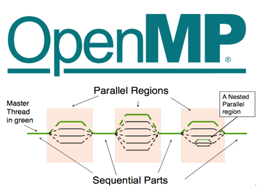

OpenMP（Open Multi-Processing）由OpenMP Architecture Review Board牵头提出的，并已被广泛接受的，用于共享内存并行系统的多线程程序设计的一套指导性注释（Compiler Directive）。它是一套支持跨平台共享内存方式的多线程并发的编程API，使用C,C++和Fortran语言，可以在大多数的处理器体系和操作系统中运行，包括Solaris, AIX, HP-UX, GNU/Linux, Mac OS X, 和Microsoft Windows。包括一套编译器指令、库和一些能够影响运行行为的环境变量。OpenMP采用可移植的、可扩展的模型，为程序员提供了一个简单而灵活的开发平台，从标准桌面电脑到超级计算机的并行应用程序接口。混合并行编程模型构建的应用程序可以同时使用OpenMP和MPI，或更透明地通过使用OpenMP扩展的非共享内存系统上运行的计算机集群。

通俗语言来讲，OpenMP实现跨平台的多线程，主线程(顺序的执行指令)生成一系列的子线程，并将任务划分给这些子线程进行执行。这些子线程并行的运行，由运行时环境将线程分配给不同的处理器。

### 发展历程：异构编译时代（2010s-至今）

2010年之后，AI的出现使得并行计算性能要求大幅度提升，CPU不能满足低延迟、高计算的需求，于是GPU和异构计算在并行计算里发挥重要作用，异构编译时代开启一直到现在。

#### CUDA和OpenCL：NVIDIA NVCC 实现 CUDA 代码生成，OpenCL支持跨厂商异构设备。

GPU 已成为高性能计算程序必可不少的一部分。GPGPU（通用GPU）使用图形处理器（GPU）进行通用计算。GPGPU编程的原理是在不同的处理器之间划分多个进程或单个进程，以加快完成速度。这里就需要并行计算框架来实现GPU加速运算让CPU和GPU协同处理大规模数据。GPGPU利用OpenCL和CUDA等并行计算加速软件，使得GPU借助数百个片上处理器核高效实现并行计算，实现这些多核处理器互相通信和协作，解决复杂的计算问题。

CUDA和OpenCL是用于GPU加速计算的异构计算框架，用于编写和管理异构系统（如CPU+GPU/FPGA等）的并行计算任务。

CUDA 是统一计算设备架构（Compute Unified Device Architecture）的代表，这个架构是 NVIDIA 于 2007 年发布的并行编程范例。CUDA 使用类 C 语言，用于开发图形处理器软件和大量 GPU 通用应用程序，这些应用程序本质上是可以高度并行开发。CUDA 是一种专有 API，因此仅支持基于 Tesla 体系结构的 NVIDIA GPU。CUDA依赖Nvidia提供的运行时编译器NVCC实现设备代码编译为特定硬件指令。

NVCC（NVIDIA CUDA Compiler）是 NVIDIA 提供的 CUDA 代码编译器，其编译过程分为 主机（Host）代码 和 设备（Device）代码 两部分，流程如下：

1. 代码分离：NVCC 首先将 CUDA 代码（.cu 文件）中的主机代码（C/C++）和设备代码（GPU 核函数）分离。

2. 主机代码编译：主机代码由主机编译器（如 GCC、MSVC）编译生成目标平台的 CPU 汇编（如 x86、ARM），最终链接为可执行文件。

3. 设备代码处理：设备代码由 NVCC 转换为 PTX（虚拟 GPU 指令）或直接通过 JIT 编译器生成目标 GPU 的 SASS 指令（如 NVIDIA Ampere/Turing 架构）。

4. 运行时整合：执行时，主机代码调用 GPU 核函数，PTX 或 SASS 指令由 GPU 驱动动态加载到显卡执行。

图中展示CUDA代码生成分层的流程：主机代码走传统编译路径（CPU），设备代码通过 NVCC 和 JIT 编译生成 GPU 可执行指令，最终实现 CPU-GPU 协同计算。

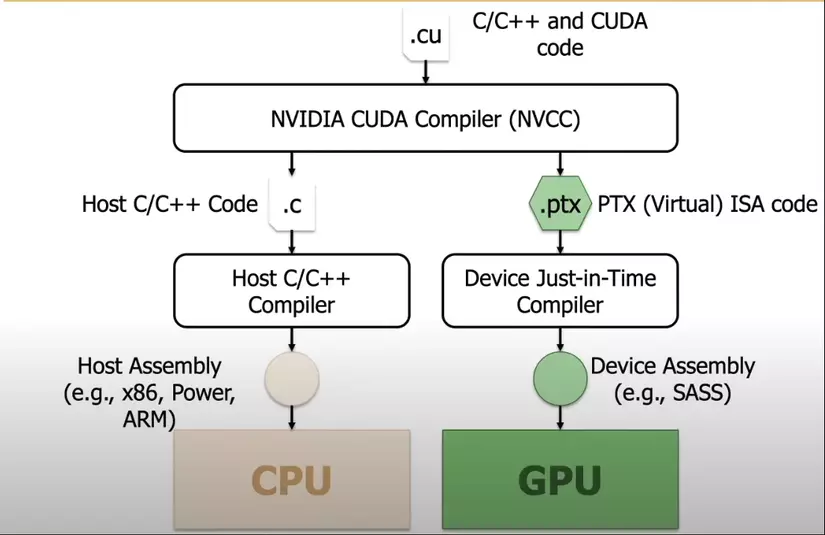

OpenCL 是开放计算语言的缩略词，由苹果公司和 Khronos 集团推出，旨在为异构计算提供一个基准，突破 NVIDIA GPU 的限制。OpenCL为GPU编程提供了一种可移植语言，使用了 CPU、GPU、数字信号处理器等。这种可移植语言用于设计程序或应用程序，让程序具有足够的通用性，可以在迥异的体系结构上运行，同时保持足够的适应性，提升每个硬件平台的性能。OpenCL依赖clBuildProgram在运行时编译内核代码（动态生成设备二进制），但开发者仍需手动管理异构逻辑。

#### SYCL和oneAPI：基于 C++ 的 SYCL编译器实现一次编写，多架构运行。

oneAPI是英特尔（Intel）推出的一个编程模型和工具集合，旨在简化跨多种处理器架构的软件开发。它是一个统一的、开放的、标准化的编程环境，可用于编写并行代码，覆盖了CPU、GPU、FPGA等不同类型的处理器。通过oneAPI，开发人员可以使用相同的代码库来针对不同的硬件进行优化，并实现更高的性能和更好的可移植性。oneAPI一个重要的特性是开放性，支持多种类型的架构和不同的硬件供应商，是一种统一的编程模型。使得开发人员拥有可以选择最佳硬件来做加速计算的自由，不用锁定某些厂商专有的硬件即可提高软件的开发生产力，并且获得与硬件加速设备相匹配的性能。

下图展示英特尔oneAPI工具的组成以及应用。oneAPI支持两种编程模型，所示第一种是直接编程（Direct Programming）有统一的编程语言SYCL，它是基于C++标准的编程语言。另一种是基于库的编程（API-Based Programming）。对于Level 0，这个跟硬件加速设备打交道的层上，如果硬件厂商实现了这层接口，那么它的设备就可以被oneAPI上层的框架使用。

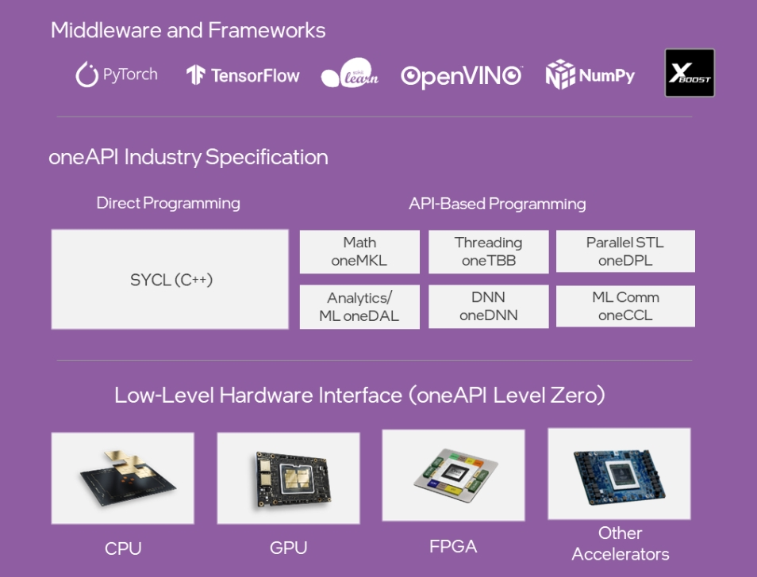

SYCL（异构编程标准）代表了一项行业标准化工作，包括对c++数据并行编程的支持，被概括为“面向OpenCL的c++单源异构编程”。SYCL是一个基于OpenCL的跨平台的抽象层，它使异构处理器的代码能够使用c++以“单一源”风格编写，使编译器能够分析和优化整个程序，而不管代码要在哪个设备上运行。它包含模板与lambda函数，便于高级应用程序编码。与OpenCL相比，SYCL提供了更高级别的抽象和更简洁的编程接口。 数据并行C++是oneAPI对SYCL编译器的实现，结合现代C++生产力与SYCL标准，实现数据并行性与异构编程。DPC++还通过简化编码、减少冗长与优化性能来提高生产力。

下图展示SYCL是一个标准化工作，有多个编译器可以在C++和SYCL中使用，包括来自Codeplay、华为、英特尔和海德堡大学的实现。这些编译器支持使用C++和SYCL编写的代码，并可以针对各种后端进行优化，包括CPU和AMD、Intel、NVIDIA等GPU。

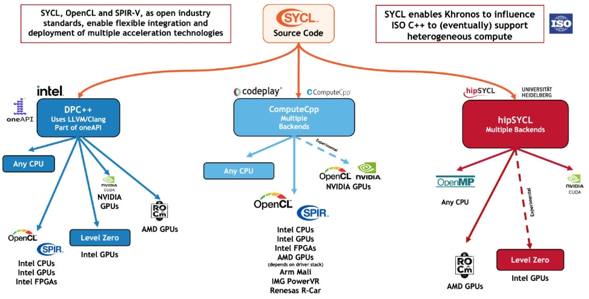

oneAPI的体系架构为开发者提供了一个统一、开放、标准化的多架构软件开发环境，支持多种处理器和硬件供应商。 SYCL作为oneAPI的直接编程语言，为C++数据并行编程提供了行业标准化的支持，简化了异构编程的复杂性，并提高了编程的生产力和性能。

下图展示oneAPI和SYCL更详细的生态位置和相关的软件栈。

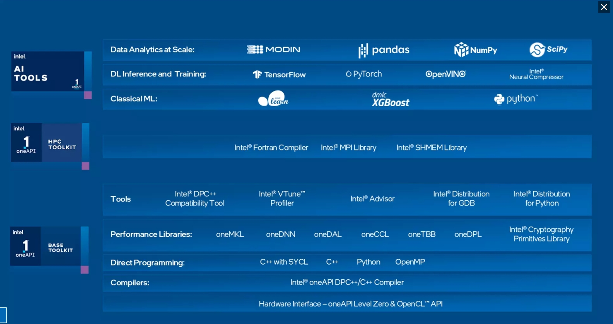

#### 国产突破：华为毕昇编译器优化鲲鹏 CPU 与昇腾 GPU 异构计算。
 
眼光放到中国，毕昇编译器是华为公司自主研发的高性能编译器工具链，首版于2020年9月30日发布，专为鲲鹏920处理器架构深度优化。该编译器基于开源LLVM框架开发，支持C、C++和Fortran编程语言，通过内存优化增强、自动矢量化等先进编译算法提升代码执行效率，结合鲲鹏Neon/Sve/Sme等内嵌指令技术，深度优化指令流水线及指令调度算法，发挥鲲鹏架构的最佳表现。下图为毕昇编译器的组成和支持情况。

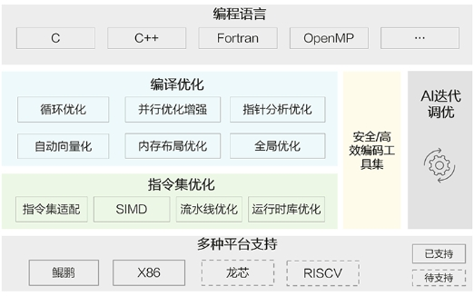

截至2025年5月，已迭代至4.2.0.1补丁版本，兼容openEuler、CentOS、Ubuntu等多种主流操作系统。在气象、安防等高性能计算领域，其性能表现显著优于GCC编译器。

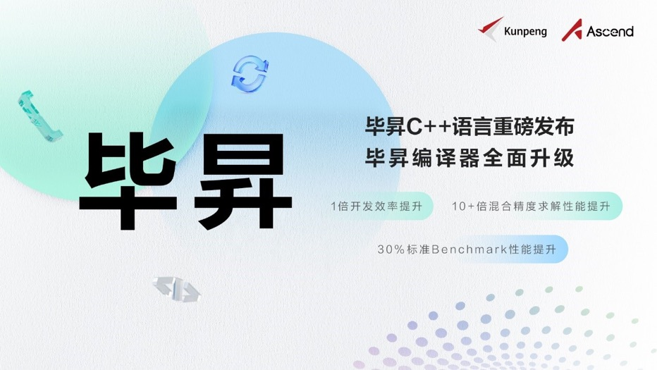

2022年华为还推出了支持多样算力编程的毕昇C++语言，实现鲲鹏与昇腾AI算力的协同优化。毕昇C++编程语言以C++为基础，支持多样性计算的异构编程标准，实现使用一种语言即可对鲲鹏、昇腾AI等业界主流算力进行编程，大大降低了多样性计算系统的编程复杂性和学习成本。此外，毕昇C++编程语言在支持通用语言规范的同时，还提供了统一矩阵编程、内存数据移动及向量化编程接口等扩展。毕昇融合编译器实现了鲲鹏、昇腾AI等多算力的融合统一编译优化。通过编译算法优化及与处理器架构深度协同，加强了自动向量化、循环优化和多面体优化等能力，标准Benchmark峰值性能提升30%。当前毕昇C++编程语言结合毕昇编译器，已与10多所高校研究机构在开展飞机噪声仿真、湍流仿真、地震模拟等多领域多样算力应用开发。基于鲲鹏加昇腾AI多样性计算架构实现了飞机噪声仿真，并实现开发效率翻倍提升，10+倍混合精度求解性能提升。

CANN异构计算架构下毕昇编译器提供异构编程编译能力。

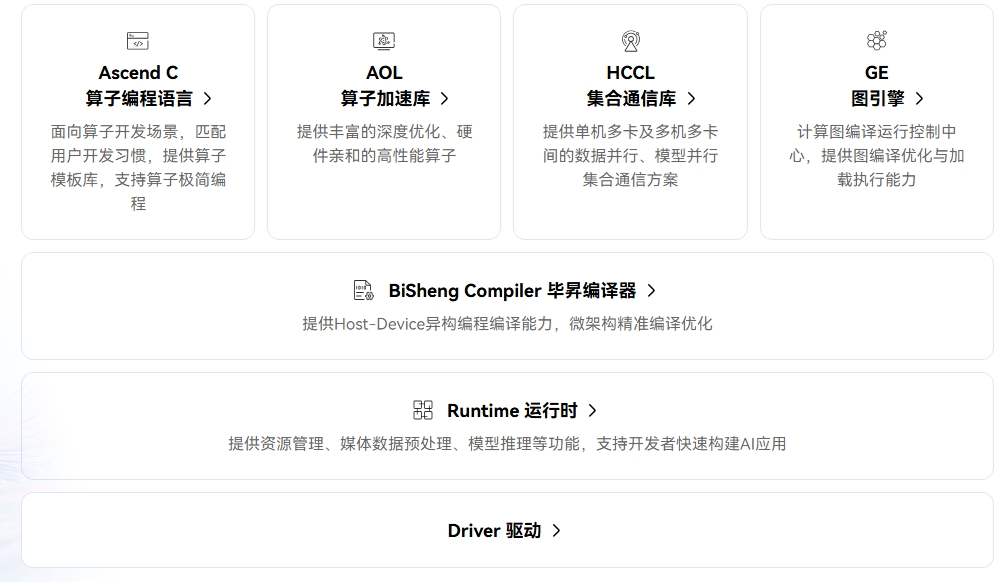

### 未来趋势

AI编译器未来发展有以下三个趋势。AI驱动自动调优通过机器学习生成最优的计算方法，提升计算效率；多级中间层表示的设计实现跨架构代码转换，降低编译器开发成本，使得多种不同硬件平台兼容更高效轻松；新兴流行的编程方式Triton进一步降低开发者开发GPU程序的学习成本。

#### AI 驱动自动调优 ：TVM、Ansor 等通过机器学习算法自动生成最优计算内核。

为了以一种高效的方式在各种硬件平台上提供这些算子，已经引入了多种编译器技术，用户使用高层级声明性语言以类似于数学表达式的形式定义计算，编译器根据该定义生成优化的张量程序。从高层定义中自动生成高性能张量程序是非常困难的。根据目标平台的架构，编译器需要在一个非常大和复杂的空间中进行搜索，其中包含优化的组合选择（例如，分块、向量化、并行化，不同的组合导致的程序性能差异极大）。寻找高性能的程序需要搜索策略来覆盖一个全面的空间，并有效地探索它。

这一过程称为自动调优，指在编译过程中，编译器或相关工具自动调整和优化代码的执行参数，以提高程序在特定硬件上的运行效率。这通常涉及到对算法、内存访问模式、并行度等多个方面的优化。自动调优的目的是减少人工干预，使得程序能够自动适应不同的硬件环境和运行条件。在 AI 领域，这尤为重要，因为 AI 模型的计算复杂度通常很高，而且不同的硬件平台（如 CPU、GPU、FPGA 等）对计算和内存访问的优化需求各不相同。

自动调优的过程通常包括以下几个步骤：

1. 性能分析：通过分析程序的运行情况，识别性能瓶颈和优化机会。

2. 参数搜索：系统地探索不同的编译选项和运行参数，寻找最佳的配置。

3. 性能评估：对不同的配置进行测试，评估其对性能的影响。

4. 反馈学习：根据性能评估的结果，调整搜索策略，进一步优化参数选择。

自动调优可以显著提高 AI 应用的运行效率，尤其是在深度学习等计算密集型任务中。然而，由于 AI 应用的多样性和复杂性，自动调优仍然是一个活跃的研究领域，研究人员和工程师们正在不断探索更高效、更智能的调优方法。在自动调优中，TVM 是走在前列的 AI 编译器，其自动调优系统已经历经三代，这里简单介绍 TVM 的这三代自动调优系统。

AutoTVM 是 TVM 的第一代自动调优系统，其是基于模板的。AutoTVM 是基于模板的 tuner，对于每一个需要调优的算子，需要使用 TVM 的 DSL 编写调优的 knob，例如循环展开的因子、循环重排序的顺序等。首先先编写模板，然后指定任务指定待调优的算子，如 resnet18 中所有的 conv2d，TVM 会根据事先编写的 conv2d 模板生成调度搜索空间。第三步指定调优参数：AutoTVM 有多个 tuner，根据 index 的 random tuner 和 grid tuner、基于遗传算法的 ga tuner、基于 Xgb 的 XGBTuner。tuner 影响的是对调度搜索空间的探索，搜索空间是巨大的难以穷举的，通过 tuner 来高效搜索相对更优的调度候选项。最后进行性能评估。对于 XGBTuner 这个具有 cost module 的 tuner，调度候选项在硬件上测量之前会使用模型预测相对性能，选出相对优的一批再去运行，这样减少真实测量的次数，减少调优时间。下图演示这个流程。

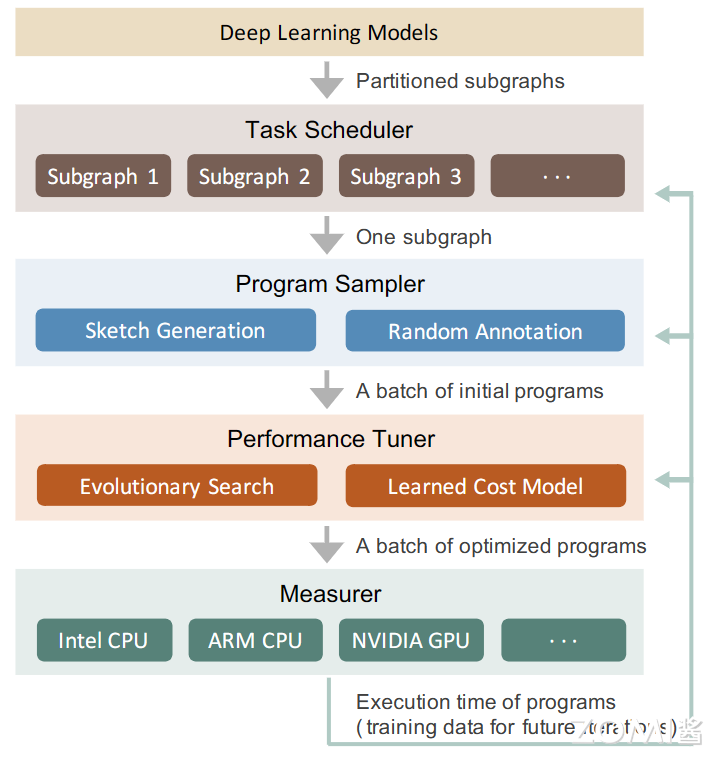

AutoTVM 需要事先编写模板来组成调度的搜索空间，最佳性能的上限取决于模板的设计，这对模板的编写带来了很高的要求。作为第二代调优系统，Ansor（Auto Scheduler）取消了模板机制，优化过程可以自动、无干预的进行：无需手动指定优化方式，编译器自动应用调度原语。Ansor 自动生成一个覆盖全面的优化的大搜索空间，并为空间中的每个张量程序提供被选择的机会。首先，它自动构建一个大的搜索空间，以覆盖给定计算定义的尽可能多的张量程序。其次，在大搜索空间中高效搜索，该搜索空间可能比现有模板可以覆盖的范围大几个数量级。最后，在优化具有许多子图的整个 DNN 时，识别对端到端性能至关重要的子图并对其进行优先级排序，因为资源是有限的，应该将调优时间和算力资源分配给对性能有更大影响的子图。

Meta Schedule 是第三代调优系统，提供以下特性： 

1.用于实现手动调优、AutoTVM 风格和 AutoScheduler 风格的统一 API。

2.所有调度原语的可扩展性，包括张量化和循环分块。在自动调优中使用新的原语几乎不需要额外的努力。

3.自动化基础设施在其每个组件上都是可扩展的。每个组件的系统可以在纯 python 或 C++或两者中轻松自定义。例如，可以开发一个新的在 python 中的调度空间生成器或者新的 ProgramRunner 等。

Meta Scheduler 遵循下图的调优流程：

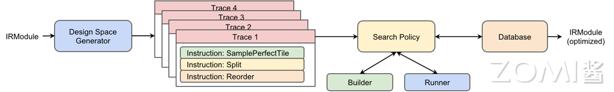

首先生成设计空间，底层系统记录了用户使用的所有调度原语，以及在采样指令上做出的随机决策，称为 Trace。Trace 可能包含零条或多条采样指令，这些指令引入调度中的不确定性，形成了一个可供探索的设计空间，例如哪一组分块大小在特定硬件上效果最佳。然后探索设计空间，Meta Schedule 提供了多种内置的探索策略，可以详尽或高效地进行搜索 ，来实现高效的调度。其搜索策略与之前调优器的搜索策略类似，可以随机搜索，也可以使用成本模型进行指导。最后所有度量记录都经过序列化并存储在数据库中。数据库记录的内容包括工作负载，序列化的 TensorIR;执行测量的硬件目标;参数类型：输入张量的形状和 dtype；运行时间等。在 Meta scheduler 中，成本模型、数据库、特征提取器、程序运行器等都是可定制、易于扩展的。

#### 多级中间表示：LLVM MLIR 项目实现跨架构代码转换，降低编译器开发成本。

为了应对日益复杂的硬件架构和日益增长的软件开发需求之间的矛盾，以及传统编译器中间表示在面对多领域、多硬件平台时所暴露出的局限性，MLIR（Multi-Level Intermediate Representation）编译器框架由谷歌的研究人员在 2017 年提出，并于 2018 年正式开源的编译器框架，MLIR 的设计理念就是创建一个通用的、可扩展的中间表示，能够统一各种编程语言和硬件架构之间的差异，从而简化编译器的开发和优化过程。

从整体架构上看，MLIR 主要由以下几个关键部分组成：

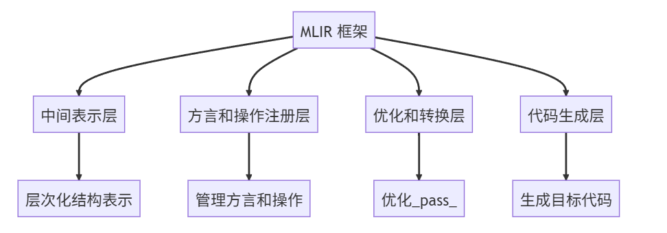

1. 中间表示层（IR） ：这是 MLIR 的核心部分，定义了各种操作、类型、属性等基本概念以及它们之间的关系。IR 的层次化结构使得它能够灵活地表示不同层次的计算逻辑和数据结构，如从高级的函数调用和控制流图到低级的硬件指令序列。
2. 方言和操作注册层 ：负责管理各种用户定义或系统提供的方言和操作。通过这个层，可以方便地添加新的方言和操作，扩展 MLIR 的表示能力。例如，不同的深度学习框架可以将其特有的操作注册为 MLIR 的方言，以便在 MLIR 中进行统一的处理和优化。
3. 优化和转换层 ：提供了丰富的优化和转换pass，这些pass 可以对 IR 进行各种变换，如常量折叠、死代码消除、算子融合、循环优化等。这些优化pass 是实现高效代码生成和性能优化的关键，开发者可以根据需要将多个pass 组合在一起，形成优化管道，对 IR 进行逐步的优化处理，以提高代码的执行效率。
4. 代码生成层 ：负责将优化后的 IR 转换为特定硬件平台的目标代码。这一层与硬件架构紧密相关，需要针对不同的硬件平台实现相应的代码生成模块，将 MLIR 的中间表示映射到硬件指令集上，生成可执行的机器代码或中间表示（如 PTX、LLVM IR 等），从而实现 AI 模型在硬件上的实际运行。

MLIR有哪些特点和优势？

MLIR的中间表示采用层次化的结构，具有多个抽象层次，高层次的、接近编程语言的表示（如类似 LLVM IR 的函数调用、控制流结构等），到低层次的、接近硬件指令的表示（如特定硬件的指令集架构细节），能够灵活地在不同层次之间进行转换和优化。MLIR 通过其统一的中间表示，能够将不同 AI 框架的模型表示转换为统一的形式，然后再根据不同硬件平台的特点进行针对性的代码生成和优化，解决硬件多样性带来的兼容性问题。

MLIR 具有很强的可扩展性，允许用户定义自己的方言（dialect）和操作（op）。方言是一组相关的操作和类型系统的集合，可以用来描述特定领域的计算模式和语义。MLIR 采用模块化的设计理念，各个组件之间相互独立，易于组合和复用，那么开发人员秩序针对特定硬件相关的少数部分进行优化，大大提升编译器开发效率和优化效果。

MLIR 拥有一个丰富的类型系统，包括标量类型、张量类型、内存类型等，能够准确地描述各种数据结构和数据布局。这对于 AI 计算来说尤为重要，因为 AI 模型通常涉及大量的张量操作，不同的硬件对张量的存储和计算方式也有所不同。MLIR 的类型系统可以清晰地表达张量的维度、数据类型、存储格式等信息，为后续的优化和硬件代码生成提供了坚实的基础，使得编译器能够更好地理解和处理 AI 模型中的数据流动和计算逻辑。

#### 面向新编程方式：比如Triton 编译器一种基于块级数据流分析的 AI 编译器。

Triton是一款开源的GPU编程语言与编译器，它的设计宗旨是提升AI模型训练过程中GPU编程的易用性与效率。它允许开发者通过Python语言编写自定义GPU内核，实现与专家级CUDA代码相当的性能表现，同时无需掌握底层CUDA专业知识。实践证明，Triton能够以不足25行代码实现与cuBLAS（NVIDIA的高度优化库）性能相当的FP16矩阵乘法内核。据OpenAI报告，基于Triton开发的特定深度学习内核比同等功能的PyTorch实现性能提升最高可达200%，充分展示了其在人工智能计算加速领域的显著潜力。

Triton相较于传统CUDA编程有相当强劲的技术优势。在CUDA C++编程模式中，开发者需要手动管理GPU架构的诸多底层细节，包括内存层次结构、线程调度等技术要素。现代GPU架构通常包含片外DRAM和片上高速缓存（每个流多处理器中的SRAM），编写高效的CUDA代码要求实现内存访问合并优化，手动配置共享内存进行数据缓存，并在数千个并行线程间进行同步协调。这些要求即使对于资深CUDA程序员而言也构成了显著挑战。Triton框架通过自动化处理这些关键优化环节，使开发者能够专注于高层算法逻辑的实现。具体而言，Triton编译器自动处理内存访问合并、共享内存分配以及GPU计算核心（SM）内的指令调度等在传统CUDA中需要手动实现的步骤。该框架仅将最高层次的任务分区（即SM间工作分配方式）交由开发者决策，为不同算法实现提供了灵活性。通过抽象线程级的底层复杂性，Triton实现了类NumPy风格的GPU代码编写模式，同时保持接近最优的性能表现。

现代GPU架构中每个流多处理器（SM）配备片外DRAM及片上SRAM缓存。Triton编译器自动优化内存访问模式和SM内部并行计算，有效减轻了开发者在GPU内存管理与线程协调方面的技术负担，从而提高了GPU编程的可访问性，并维持高性能计算能力。

尤为重要的是，Triton深度集成于Python生态系统，能够与深度学习工作流程实现无缝对接。开发者可直接从Python环境（包括PyTorch代码）调用Triton内核，无需编写C++或CUDA代码，这一特性使其特别适合研究实验与自定义层优化场景。综合而言，Triton的应用领域主要集中在AI模型训练与其他GPU并行计算任务上，这些场景同时要求高性能计算能力和开发便捷性。它有效弥合了高级框架（如PyTorch）与底层CUDA之间的技术鸿沟，使开发者能够针对特定需求高效实现专用GPU内核。

以下是Triton的概览图。

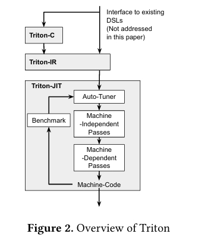

Triton是一种围绕 “分块（tile）” 概念构建的语言和编译器。它包括基于 C 的语言（Triton - C）用于以参数化分块变量表达张量程序，以及基于 LLVM 的中间表示（Triton - IR），并通过一系列分块级优化将程序编译为高效 GPU 代码。Triton - C为现有深度学习转编译器及熟悉 GPU 编程的程序员提供稳定接口，以方便表达张量程序。Triton - IR 的目的是提供适合分块级程序数据流和控制流分析、转换和优化的环境。它直接从 Triton - C 在解析时构建，未来也可从更高层 DSL 直接生成。然后到Triton - JIT编译器将 Triton - IR 程序编译为高效机器码，通过机器无关和机器相关的优化过程，并借助自动调谐引擎，实现性能优化，确保编译后的代码能在目标硬件上高效运行。

## 计算库：从基础数学到领域专用

### 发展历程：经典数学库（1970s-2000s）

### 发展历程：领域专用库（2010s至今）

### NVIDIA CUDA 计算库

### 未来趋势

## 存储系统：本地IO到分布式高速访问

### 发展历程1：本地存储时代（1980s-2000s）

### 发展历程2：并行文件系统（2010s-Today）

### 未来趋势

## 通信中间件：从MPI到跨架构互联

### 发展历程：MPI统治时代（1990s-2010s）

### 发展历程：多协议协同（2020s至今）

### 未来趋势

## 调度系统：从静态分配到智能动态管理

### 发展历程：早期阶段（1990s-2000s）

### 发展历程：现代调度系统（2010s至今）

### 未来趋势

## 应用软件

### 阶段1：专用代码时代（1990s-2000s）

### 阶段2：社区软件包崛起（2000s-2010s）

### 阶段3：多学科融合与AI赋能（2020s-至今）

### 行业应用1：基础科学领域

### 行业应用2：工程制造领域

### 行业应用3：地球科学领域

## 总结与思考

## 本节视频

<html>
<iframe src="https:&danmaku=0&t=30&autoplay=0" width="100%" height="500" scrolling="no" border="0" frameborder="no" framespacing="0" allowfullscreen="true"> </iframe>
</html>

## reference
https://zh.wikipedia.org/wiki/Fortran#FORTRAN

https://www.qast.com/pgroup/htm/about.htm 

https://zh.wikipedia.org/wiki/OpenMP

https://www.incredibuild.cn/blog/cuda-vs-opencl-gpu-bianchenggaiyongshenme

https://zhuanlan.zhihu.com/p/697611565

https://www.intel.com/content/www/us/en/developer/tools/oneapi/overview.html

https://www.intel.cn/content/www/cn/zh/developer/articles/technical/oneapi-what-is-it.html

https://www.hiascend.com/software/cann

https://developer.huawei.com/home/forum/kunpeng/thread-02106154315995186024-1-1.html

https://e.huawei.com/cn/news/ebg/2022/bisheng-c-upgrades-bisheng-compiler

https://baike.baidu.com/item/%E6%AF%95%E6%98%87/53936900?fr=aladdin#reference-3

https://developer.aliyun.com/article/1644057

https://cloud.tencent.com/developer/article/2540075

https://www.eecs.harvard.edu/~htk/publication/2019-mapl-tillet-kung-cox.pdf

https://zhuanlan.zhihu.com/p/12890124532

https://zhuanlan.zhihu.com/p/1895776568367894849