<!--Copyright © ZOMI 适用于[License](https://github.com/Infrasys-AI/AIInfra)版权许可-->

# 为什么需要集合通信

Author by: SingularityKChen

本章将会介绍 AI 与通信的关系，以及 XCCL 基本架构。

## 介绍

### 谁应该了解集合通信？

以下三类从业者需要了解集合通信：

- **系统工程师**：理解 PCI 拓扑结构、交换机支持、网络技术与拓扑如何影响 AI 训练性能。
- **开发者**：需要实现涉及 NPU 内部或 AI 集群通信的算法或应用。
- **使用者**：明确特定平台的性能预期和扩展性。

### 课程位置

集合通信概览包含以下内容：通信算法、通信链路、通信操作和通信域管理。本章集中在通信算法和通信链路。

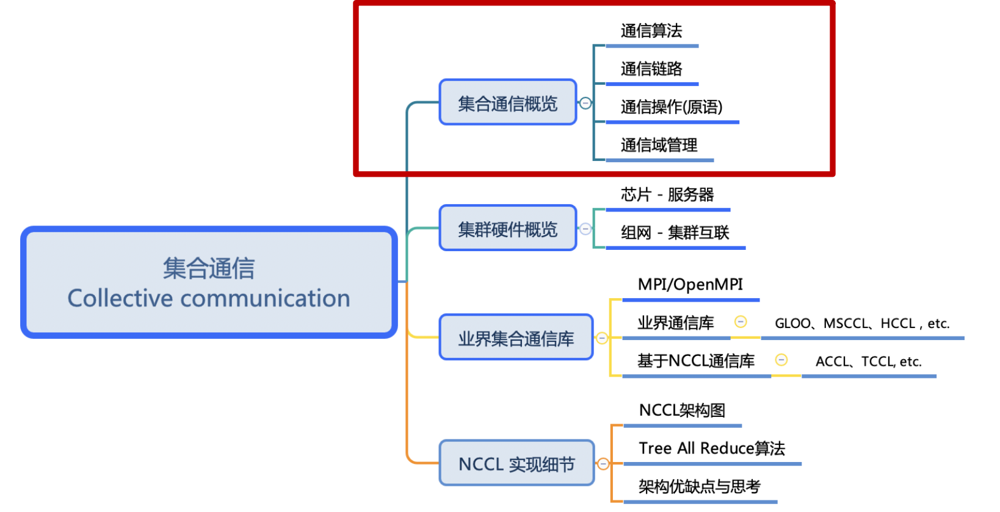

## AI 与通信关系

本节简要回顾神经网络及其训练过程的基础计算，并回顾近年来 AI 训练和推理过程中涉及的分布式和并行计算模式。

### 单卡训练神经网络模型

神经网络训练的过程是神经网络模型通过梯度下降算法优化参数的过程。在单卡训练中，神经网络模型的训练过程主要依赖于单个GPU卡的计算能力。

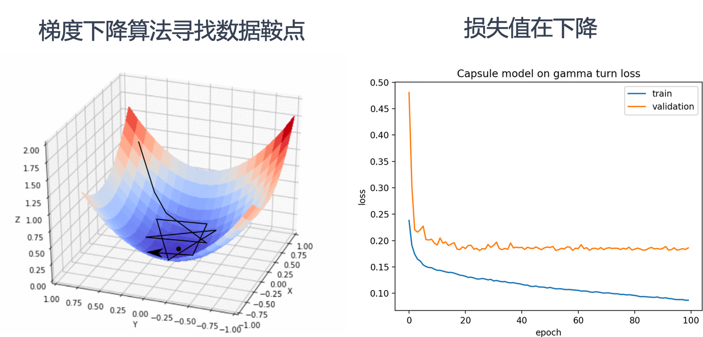

上图左侧展示了梯度下降算法在三维空间中寻找数据鞍点的过程。梯度下降算法通过不断调整参数，沿着损失函数的负梯度方向移动，以最小化损失函数。图中的三维曲面表示损失函数，黑色线条表示梯度下降算法的路径，最终目标是找到损失函数的最小值点，也称为鞍点。

上图右侧展示了训练过程中损失值的变化情况。横轴表示训练的轮数（epoch），纵轴表示损失值。蓝色曲线表示训练集上的损失值，橙色曲线表示验证集上的损失值。随着训练轮数的增加，损失值逐渐下降，表明模型在不断优化，性能在提升。

左侧图中梯度下降算法逐步找到损失函数的最小值点，对应右侧图中损失值随着训练轮数的增加而逐渐降低。

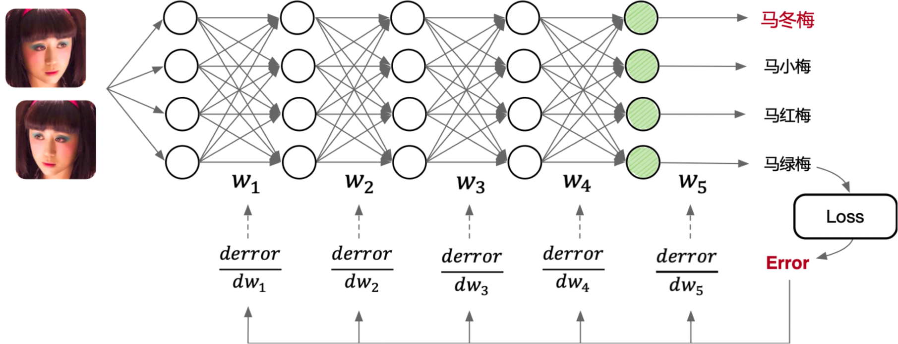

如上如图所示，一个典型的多层前馈神经网络包含输入层、多个隐藏层和输出层。输入层接收图像数据，这些图像数据通过网络的各个层进行处理。每个层之间通过权重矩阵（$W_1$, $W_2$, $W_3$, $W_4$, $W_5$）连接，数据在前向传播过程中经过线性变换和非线性激活函数处理，最终在输出层生成预测结果。

训练过程中，计算预测结果与真实标签之间的误差（Loss），并通过反向传播算法将误差逐层传递回网络。在反向传播过程中，计算每一层权重矩阵的误差梯度（$\frac{derror}{dw_1}$, $\frac{derror}{dw_2}$, $\frac{derror}{dw_3}$, $\frac{derror}{dw_4}$, $\frac{derror}{dw_5}$），并根据这些梯度更新权重矩阵，以最小化损失函数。

上述整个过程都在单个GPU卡上完成，计算资源和数据处理均依赖于该卡的性能。单卡训练适合中小规模的模型和数据集，但对于大规模模型和数据集，单卡的计算能力可能成为瓶颈，这时就需要引入多卡并行训练来提升效率。

### 分布式训练与多卡并行

在单卡训练的基础上，多卡并行训练可以显著提高训练速度和效率。多卡并行训练通过将模型和数据分布到多个GPU卡上，利用多个卡的计算能力同时进行训练，从而加速模型的收敛。

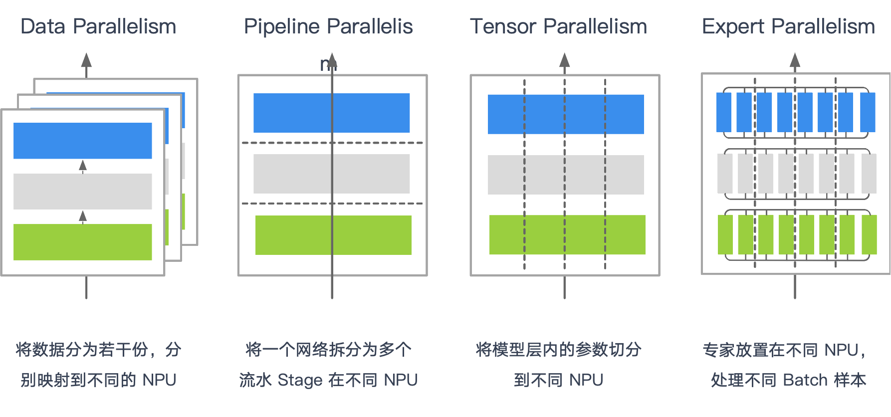

以下是常见的多卡并行策略：

- **数据并行（Data Parallelism，DP）**：每个设备拥有完整的模型副本，处理数据集的不同子集，计算梯度后通过通信原语 **AllReduce** 进行梯度汇总。
- **流水并行（Pipeline Parallelism，PP）**：模型按层切分为多个阶段，每个设备处理不同的阶段，各阶段之间通过通信原语 **Send/Recv** 交换数据、**AllReduce** 进行梯度汇总。
- **张量并行（Tensor Parallelism，TP）**：将模型的张量参数拆分到不同设备上，各设备独立完成部分计算，通过通信原语 **AllGather** 合并计算结果。
- **专家并行（Expert Parallelism，EP）**：将专家模型（Mixture of Experts）分布到不同设备，每个设备独立处理特定子任务，通过通信原语组合 **All2All（Send/Recv）** 专家模型输出。
- **多维并行（Multi Parallelism）**：以上述一种或多种方式进行组合，以满足复杂训练场景需求，例如 MoE（All2All 通信）、FSDP（AllGather）、长序列处理（AllGather、AllReduce）。

分布式训练的优势如下：

- **加速训练**：通过将计算任务分配到多个卡上，多卡并行训练可以显著减少训练时间。
- **处理大规模模型**：单卡可能无法容纳非常大的模型，多卡并行可以将模型分割到多个卡上，从而支持更大规模的模型。
- **提高资源利用率**：充分利用多个卡的计算资源，提高整体训练效率。

但其在实践中也有一些挑战：

- **通信开销**：多个卡之间需要频繁通信以同步数据和梯度，这可能会增加通信开销。
- **复杂性增加**：实现多卡并行需要更复杂的代码和配置，对开发者的技能要求更高。
- **调试困难**：多卡并行训练的调试和优化比单卡训练更复杂。

#### 数据并行 Data Parallelism

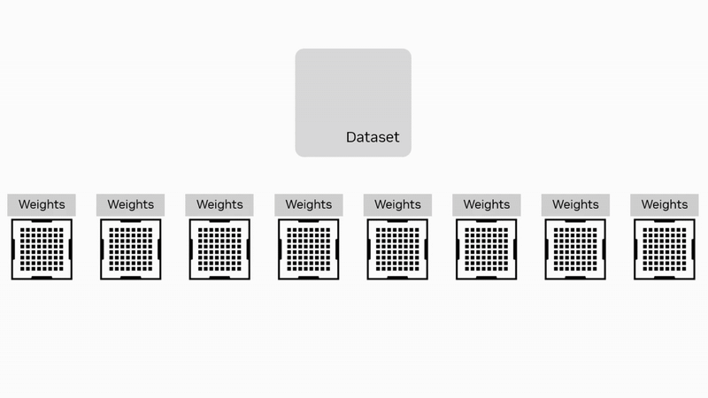

数据并行是最常用的并行策略之一。在这种策略中，数据集被分割成多个子集，每个子集分配给不同的计算卡。每个卡上都保存模型的完整副本，并独立计算梯度。计算完成后，通过集合通信算法 **AllReduce** 将所有卡的梯度汇总，计算出全局梯度，并更新模型参数。

#### 流水并行 Pipeline Parallelism

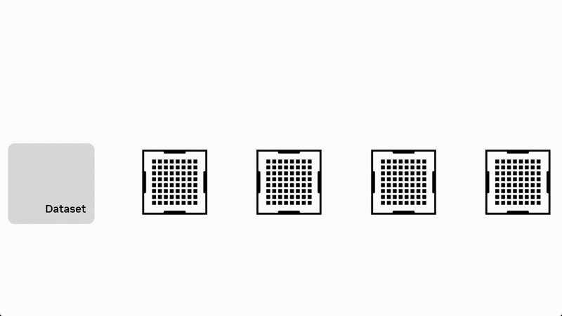

流水并行将模型按层分为多个连续阶段（Stage），每个阶段放置在不同设备上。数据以流水线方式在阶段之间流动，通过集合通信原语 **Send/Recv** 进行数据传输，全局梯度同步还需要用到集合通信原语 **AllReduce**。流水并行的优势在于能够同时并行处理模型不同部分的数据，减小单阶段计算压力，但需合理设计以减少通信等待。这种策略通过重叠计算和通信来提高效率。

#### 张量并行 Tensor Parallelism

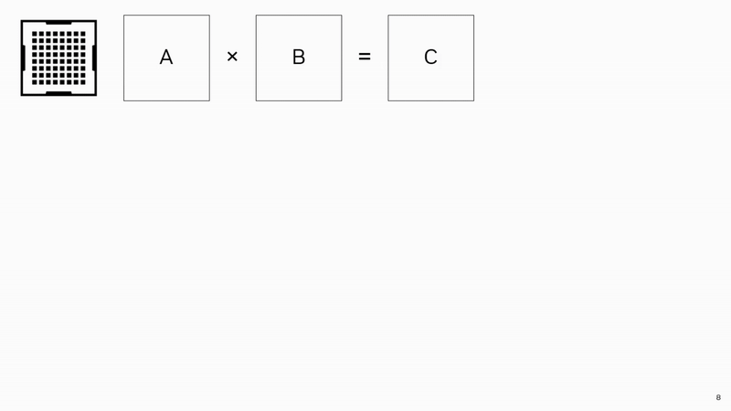

张量并行适用于模型规模特别大的场景，它将单个模型层内的大型矩阵或张量计算分割到多个设备上并行处理。计算完成后，使用集合通信原语 **AllGather** 汇总计算结果。张量并行的关键是高效切分计算任务并降低通信成本。

#### 专家并行 Expert Parallelism

专家并行适用于专家混合模型（Mixture of Experts，MoE），将多个专家模型分别放置在不同设备，每个设备处理特定的数据或任务。各专家模型独立运算后，通过集合通信原语 **All2All** 来组合输出。

#### 多维并行 Multi Parallelism

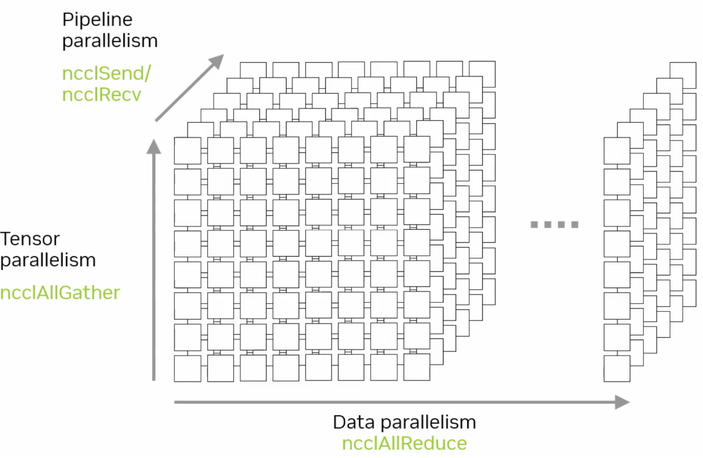

多维并行组合了数据、流水、张量与专家并行等多种策略，以适应复杂的训练场景。例如：

- MoE (Mixture of Experts)：使用 All2All 进行专家之间的数据交互。
- FSDP (Full Sharded Data Parallelism)：模型参数分片到多个设备，通过 AllGather 同步数据。
- 长序列（Long Sequence）：需要结合 AllGather 与 AllReduce 等通信原语，以高效处理长序列数据。

多维并行对系统的通信和计算效率要求较高，需精确的策略组合以确保性能优势。

通过上述并行策略与对应的集合通信原语，分布式训练能够高效地利用多设备算力，有效加速 AI 模型训练过程并扩展模型处理能力。

<!-- ## 为什么需要集合通信算法

- 通信算法
- 通信原语/操作
- 拓扑算法很多，但不是所有拓扑算法都能满足实际生产需求，需要具体问题具体分析、具体场景具体设计，因此出现了XCCL -->

## XCCL 基本架构

XCCL（XXXX Collective Communication Library）架构源自于高性能计算（HPC）的集合通信架构，经过优化和演进，以满足当前 AI 场景的特殊通信需求。本节从 HPC 和 XCCL 通信架构对比介绍，展示二者的异同。

### 计算与通信解耦

在传统的神经网络训练过程中，每一层计算得到的梯度会立即进行集合通信（如AllReduce），这种计算与通信同步串行的方式严重影响了集群的整体算力利用率（Model Flops Utilization，MFU）。例如，以 GPT-3 为例，若每层梯度计算需要 1ms，通信需要 500ms，则整个训练过程将显著延长。

为解决这一问题，XCCL 采用计算与通信解耦的策略，将计算和通信两个过程独立执行，分别优化。通过性能优化策略减少通信频率，提升整体性能，可以达到：

- 提升集群训练性能（HFU/MFU）
- 防止通信等待时间过长导致的“假死锁”问题

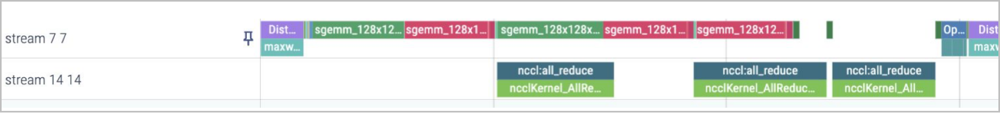

上图 Stream 77 和 14 分别是计算和通信的进程。

### 分布式加速库

分布式加速库：解耦计算和通信，分别提供计算、通信、内存、并行策略的优化方案。

- DeepSpeed
- Megatron-LM
- MindSpeed
- ColossalAI

这些库分别提供了针对计算、通信、内存和多种并行策略的优化方案，以提升分布式训练性能。详细内容可以参考以下视频：

### HPC 到 AI 通信栈基本架构

HPC 场景中的集合通信（如 MPI）关注于传统的高性能计算任务，而 AI 场景中的通信需求则更为特殊，如频繁的梯度同步、更复杂的数据流动模式。

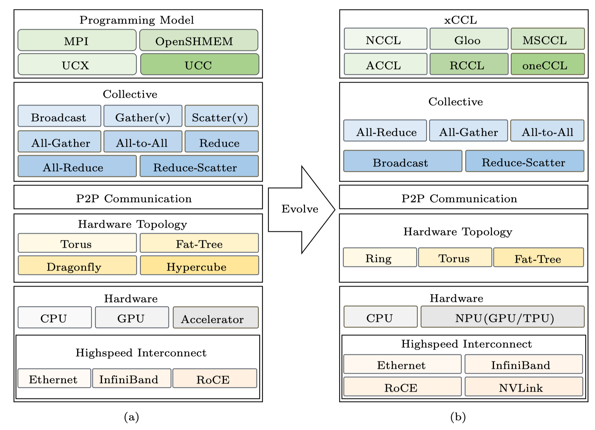

如上图所示，XCCL 架构从传统 HPC 通信栈演化而来，主要体现在编程模型、通信原语、拓扑结构与硬件平台等多个维度：

- **编程模型**：从 MPI/OpenSHMEM/UCX 向 NCCL/Gloo/oneCCL/MSCCL 等 AI 定制通信库演进。
- **通信原语**：XCCL 提供的通信原语主要集中在 AllReduce、AllGather、Broadcast、ReduceScatter、All2All 等，贴合 AI 训练过程中的梯度汇总、张量广播、专家路由等操作。
- **拓扑结构**：从 Hypercube、Dragonfly 等 HPC 网络拓扑向 Ring、Torus、Fat-Tree 等更适合深度学习通信模式的结构演进。
- **硬件平台**：多了 AI 专有的 NPU/TPU 进行计算加速。
- **硬件高速接口**：AI 通信体系引入 NVLink、NVSwitch 等高带宽、低延迟的 GPU/NPU 专用互连方案，替代部分传统 PCIe 与 RoCE 通道。

### XCCL 在 AI 系统中的位置

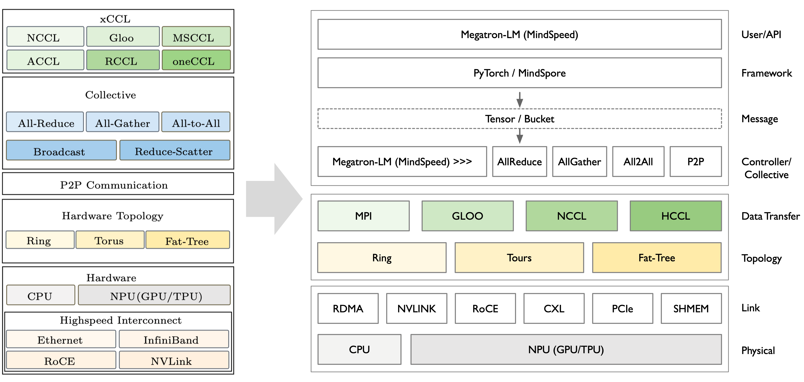

如上图所示，XCCL 在 AI 训统中处于训练框架与底层通信执行之间的中间层，协同框架调度与硬件通信资源。

AI 系统分层如下：
- AI 软件层
  - 用户/API接口层
    - Megatron-LM / MindSpeed：分布式训练控制器，控制通信粒度与并行策略。
  - AI 框架层
    - PyTorch / MindSpore：主干深度学习框架，负责计算调度与梯度产生。
  - 消息层
    - 模型训练过程中，各层产生的张量放在不同的 Bucket 中。
  - 集合通信操作接口
    - 框架通过 Megatron-LM 控制器触发下列通信操作：AllReduce、AllGather、All2All、P2P（点对点）通信
- 中间层
  - 数据传输层
    - 提供统一的通信操作调用接口：
      - MPI、Gloo、NCCL、HCCL 等通信库，适配不同硬件与部署环境。
  - 拓扑逻辑层
    - 网络拓扑支持：Ring、Torus、Fat-Tree 等常见结构。
- 硬件层
  - 链路层
    - 底层互联硬件接口和协议：RDMA、NVLINK、RoCE、PCIe、CXL、SHMEM。
  - 物理层
    - CPU：控制节点或通用计算节点。
    - NPU（GPU / TPU）：执行实际计算与通信操作。

Megatron-LM/MindSpeed 分布式加速框架**解耦了计算与通信**：
  1. 计算主要通过 PyTorch 等 AI 框架执行；
  2. 通信通过 XCCL 通信库来执行；

计算过程为：
- 将框架计算出来 Tensor 记录到 Bucket 中
- 通过控制层在后台启动 loop 线程
- 周期性的从 Bucket 中读取 Tensor
- 控制层在节点之间协商一致后，进行消息分发到具体 NPU 上执行通信

## 小结与思考

本章我们学习了：

1. AI 神经网络模型学习/训练阶段为什么要通信（AI 基础知识、训练推理、分布式并行）
2. XCCL 在 AI 系统中的位置（HPC 通信架构 to XCCL 通信架构）

## 本节视频

<html>
<iframe src="https://player.bilibili.com/player.html?aid=1255396066&bvid=BV18J4m1G7UU&cid=1570235726&page=1&as_wide=1&high_quality=1&danmaku=0&autoplay=0" width="100%" height="500" scrolling="no" border="0" frameborder="no" framespacing="0" allowfullscreen="true"></iframe>
</html>