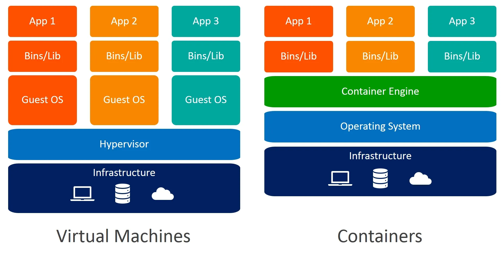

<!--Copyright © ZOMI 适用于[License](https://github.com/Infrasys-AI/AIInfra)版权许可-->

# 资源的限制

Author by: 张柯帆

> 注：以下讨论基于 Linux

在上一篇文章中，我详细介绍了容器中用来实现“隔离”的其中一种技术手段：Namespace。现在你应该已经明白，Namespace 技术的原理就是修改进程的视图，让进程只能“看到”操作系统一部分的内容。但视图的遮盖终究只是障眼法，对于宿主机来说，这些“隔离”进程与其他进程并没有什么不同。为了实现完整的资源隔离，我们还需要限制容器对 CPU、内存、磁盘资源的访问，否则当其中一个容器将宿主机的资源消耗光了，就会影响到宿主机上的其他容器。

如果你还记得上面这张图，仔细观察会发现只有虚拟机方案才有 Hypervisor 这个组件。这是因为 Hypervisor 主要负责创建虚拟化的硬件，在这个步骤里也间接地完成了资源访问的限制。而 Container Engine 并没有 Hypervisor 这样的功能，所以需要另寻他法进行资源限制，幸好 Linux 操作系统也为我们提供了这样的能力——Cgroups。