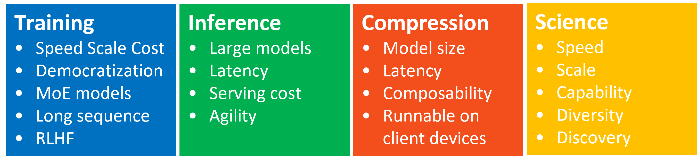

<!--Copyright © ZOMI 适用于[License](https://github.com/Infrasys-AI/AIInfra)版权许可-->

# DeepSpeed 介绍

随着 chatgpt 等模型引发人工智能领域的浪潮，越来越多的公司和团体想要快速、方便地训练和部署自己的类 chatgpt 模型。但是随着训练模型的大小和训练数据的规模越来越大，训练成本也随之增加，往往需要大规模的集群和数百上千的训练卡用于模型训练，并且具备相对较高的机器利用率和更好的吞吐,而传统训练的方法则面临内存限制和计算瓶颈等挑战。基于这样的现状，微软研发并开源了一个高效且易于使用的开源系统，这就是我们所熟知的 DeepSpeed 框架，目前已经成为大模型训练的主流框架。

DeepSpeed 助力于打造全球最强大的语言模型,例如[MT-530B](https://www.microsoft.com/en-us/research/blog/using-deepspeed-and-megatron-to-train-megatron-turing-nlg-530b-the-worlds-largest-and-most-powerful-generative-language-model/)和[BLOOM](https://huggingface.co/blog/bloom-megatron-deepspeed).作为一款易于使用的深度学习优化的软件套件,DeepSpeed 提供以下核心支持:

* 支持数十亿,甚至千亿参数规模的稠密或者稀疏模型的训练和推理
* 能够实现优异的系统吞吐,并且可以高效扩展到数千个 GPU
* 即使在资源受限的 GPU 系统上,也可以进行训练和推理
* 在推理上实现超低的延迟和超高的推理
* 以较低的成本实现极致的压缩,带来超高推理延迟优化和模型尺寸的大幅减小

DeepSpeed 主要包含以下四个核心的创新支持

在本节中,我们主要聚焦于 DeepSpeed 的 training 部分.

## 