<!--Copyright © ZOMI 适用于[License](https://github.com/Infrasys-AI/AIInfra)版权许可-->

# 流水并行1F1B/1F1B Interleaved原理

abstract：先前介绍的Gpipe存在硬件利用率低，动态内存压力大的问题，本篇介绍新的流水线技术来规避

## PipeDream基本原理

回顾一下Gpipe流水并行存在动态峰值内存大的问题，如图所示：若输入batch被划分为n个micro-batch，则对于任意device，需要缓存n份前向激活值（图中n=8）.


PipeDream流水线并行采取了**1FIB**的策略，很好的规避了硬件内存有限的问题。

在流水线并行（pipeline parallel）中，每次前向计算产生的 activation 只有在对应的反向计算完成之后才能释放（即使使用了 Checkpointing 技术）。因此，要尽可能地节省 activation 占用的显存，就需要尽量缩短每份 activation 在内存中停留的时间，也就是让它们尽早被释放。要做到这一点，关键便是让每micro-batch 的反向计算尽早开始并完成。具体做法是，将反向计算的优先级调高，使得编号较小的 micro-batch 的反向步骤，能在编号较大的 micro-batch 的前向步骤之前执行。以一个多阶段（stage）流水线为例：如果我们让最后一个 stage 在完成当前 micro-batch 的前向计算后，立刻启动该 micro-batch 的反向计算，那么后续的各个 stage 就能更早地收到反向计算的数据，进而开始它们自己的反向计算。通过这种“前向做一批、反向紧跟一批”（1F1B one-forward-one-backward）的调度策略，不仅能够减少 activation 在显存中的滞留时间，还能平衡各个 stage 的计算负载，最终最大化显存利用效率并降低整体训练时的内存峰值需求。

因此我们实现了将激活值数量上限从 micro-batch 数量 **m** 变成 pipeline stage 阶段 **p**，但只是降低了设备的峰值内存，并没有降低气泡大小，因此空泡率与Gpipe保持一致，为：
$$
\begin{equation}
bubble ration=\frac{t_{bubble}}{t_{ideal}}=\frac{p-1}{m}
\end{equation}
$$


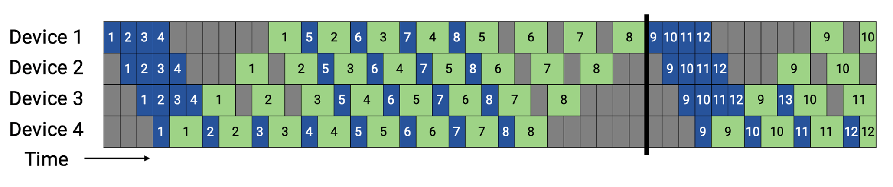

## Virtual pipeline基本原理

后续Megatron-LM在1F1B的基础上做了Interleaved 1F1B的优化，减少了流水线气泡，也就是本篇介绍的虚拟流水并行（Virtual Pipeline Parallelism，简称VPP）。

VPP的核心在于，让一个物理层面的device虚拟成为v个devices，device从计算1个或连续layer段到计算v个不相邻的layer，如图所示：GPU1之前只负责layer1或layer1+layer2层的计算，经过虚拟化流水线后，负责layer0和layer5层的计算，使得layer1层计算完成后无需等待layer2的计算，可以直接进入GPU2进行计算，从而减少等待空泡时间，此处v被称为虚拟流水线阶段（virtual pipeline stage）。
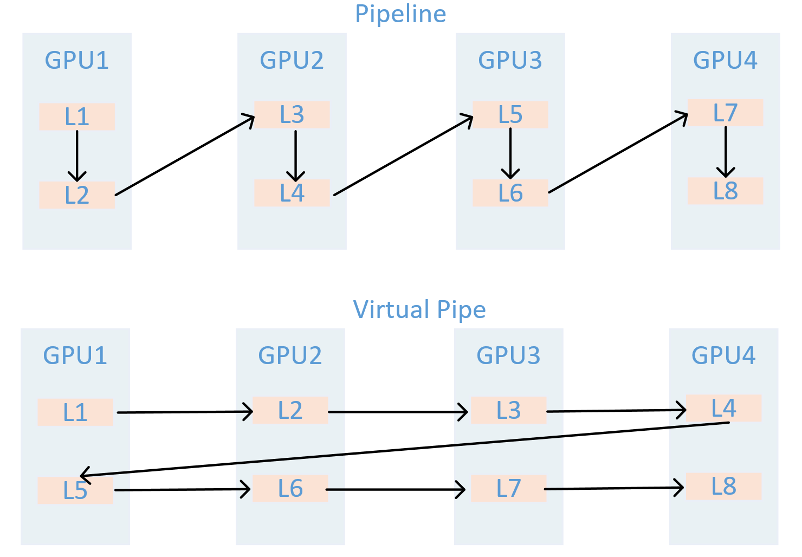
假设模型总层数为16，张量并行大小tp=1，流水线并行大小pp=4，虚拟流水线并行大小v=2，则模型将被划分为4 * 2 = 8个阶段，每个阶段包含16 / 8 = 2个层。前向的顺序为GPU 1 -> GPU 2 -> GPU 3 -> GPU 4 -> GPU 1 -> GPU 2 -> GPU 3 -> GPU 4。
在设备数量不变的情况下，分出更多的流水线阶段，这样可以让流水线中每个 stage 更小，因而下个 stage 的等待时间更短，气泡更小。需要注意的是，m需要是p的整数倍。
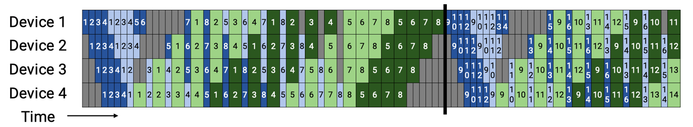
𝑚为micro-batch，𝑝为pipeline stages，v为 virtual pipeline stage,完成v个layer段中一个的前向、后向时间分别为$t_f/v$和$t_b/v$,流水线气泡的耗时$t_{pd}^{int}$:
$$
\begin{equation}
t_{pd}^{int}=\frac{(p-1)*(t_f+t_b)}{v}
\end{equation}
$$
因此可得出VPP的空泡率：
$$
\begin{equation}
bubble ration=\frac{1}{v}*\frac{p-1}{m}
\end{equation}
$$
空泡率除了跟 micro batch 成反比，与 v 也成反比。

需要注意的是，VPP是以增加通信量为代价，换取更低的空泡比率，相比于1FB现在的气泡占比就减少到了1/v。但是流水线之间的通信量也增加了v倍。对于一个 pipeline stage，里面包括多个 Transformer layer，所以现在相当于流水线的stage增加了，通信量也会增加。特别是当global的batch越来越大的时候，这个通信开销就会更显著。

## 新兴PP技术（扩充）

### PipeDream-2BW

PipeDream-2BW 是一种面向超大规模深度模型的异步流水线并行方法：它将模型切分为多个阶段并复制多路流水线，在 1F1B 调度下通过“双缓冲”权重更新和梯度合并技术，大幅降低显存占用与通信开销；内置的自动化 Planner 根据设备内存和互联拓扑搜索最优阶段划分与复制宽度，并可选激活重计算；在多卡集群上训练大规模 Transformer 模型时，相较于传统流水线并行，吞吐量可提升数倍，同时保留与数据并行一致的权重更新语义。
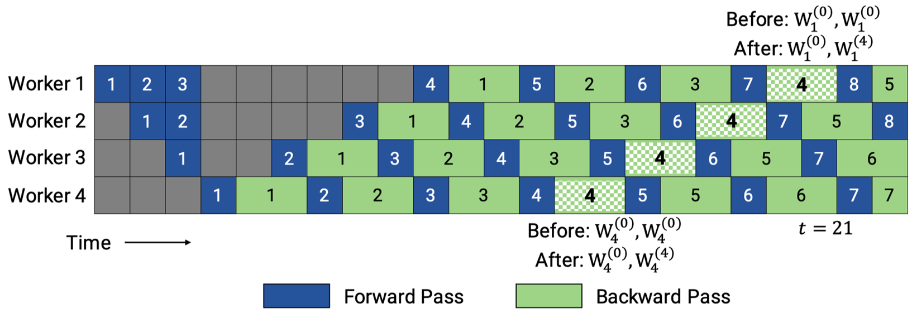

### ZB-V schedule

ZB-V schedule 是一种面向流水线并行的内存高效零气泡调度策略：它将p个阶段划分为2p个模型块，并给每个 worker 分配两个模型块，按照从首到尾再返回首的V型顺序进行分配，以确保每个微批次的前向和对权重的后向都在同一worker上执行，从而利用后向权重计算填充流水线空隙；在与1F1B相同的显存约束下，可在正向、后向输入与权重后向计算时间相等时实现近零气泡；同时，该调度保持各 worker 峰值激活内存均衡，兼顾吞吐与显存效率。
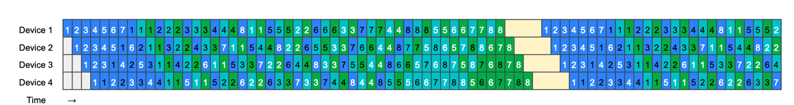

### Hanayo wave-like pipeline

Hanayo 是一种波浪式流水线并行策略：它将模型划分为S个阶段并将小批次分成W个波（wave），以波浪形的顺序在各阶段交错执行前向和后向计算，能够将流水线气泡比例降低至原来的1/(2W) 且无需复制模型，从而保持与主流方法一致的权重和激活内存占用；同时，其轻量级运行时引擎将调度逻辑与执行和通信优化解耦，支持在多卡集群上灵活部署；在对GPT和BERT类模型、最多32块GPU的测试中，Hanayo相较最先进方案实现了最高30.4%的吞吐量提升
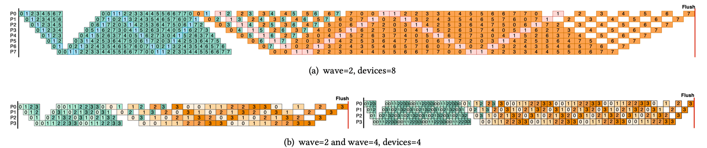

## 分布式框架里的PP实现

- 模型运行入口与PP配置：
pretrain_gpt.py main函数调用pretrain->get_model,get_model函数判断pipeline的划分策略
```
Megatron-LM/pretrain_gpt.py

if __name__ == "__main__":

    # Temporary for transition to core datasets
    train_valid_test_datasets_provider.is_distributed = True

    # Optionally enable inprocess restart on pretrain
    pretrain, store = inprocess_restart.maybe_wrap_for_inprocess_restart(pretrain)

    pretrain(
        train_valid_test_datasets_provider,
        model_provider,
        ModelType.encoder_or_decoder,
        forward_step,
        args_defaults={'tokenizer_type': 'GPT2BPETokenizer'},
        extra_args_provider=add_modelopt_args if has_nvidia_modelopt else None,
        store=store,
    )
```

pretrain函数内部调用setup_model_and_optimizer函数，该函数内部调用get_model
```
Megatron-LM/megatron/training/training.py/def pretrain

# Model, optimizer, and learning rate.
timers('model-and-optimizer-setup', log_level=0).start(barrier=True)
app_metrics['app_build_optimizer_start_time'] = one_logger_utils.get_timestamp_in_ms()
model, optimizer, opt_param_scheduler = setup_model_and_optimizer(
    model_provider, model_type, checkpointing_context=checkpointing_context
)

Megatron-LM/megatron/training/training.py/def setup_model_and_optimizer

def setup_model_and_optimizer(
    model_provider_func,
    model_type,
    no_wd_decay_cond=None,
    scale_lr_cond=None,
    lr_mult=1.0,
    checkpointing_context=None,
):
    """Setup model and optimizer."""
    args = get_args()
    timers = get_timers()
    one_logger = get_one_logger()

    model = get_model(model_provider_func, model_type)
    unwrapped_model = unwrap_model(model)
```

get_model通过get_args函数拿到启动脚本设置的超参，参数设置如图所示：
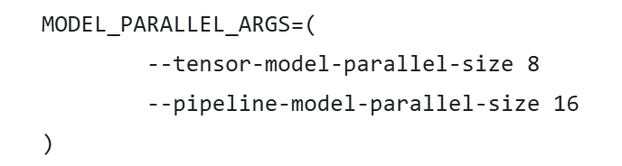
```
Megatron-LM/megatron/training/training.py/def get_model

def get_model(model_provider_func, model_type=ModelType.encoder_or_decoder, wrap_with_ddp=True):
    """Build the model."""
    args = get_args()
    args.model_type = model_type

    # Build model.
```

此处分为两种情况讨论，以下是启用虚拟管道(VPP)的模型构建，判断条件如第一个if所示。判定逻辑标记了：只有第一个rank做输入，最后一个rank做输出，利用model_provider_func函数计算当前Rank该“切”哪一段 Transformer 层并实例化，最终把所有Rank按顺序放入model列表，供后面的流水线调度器循环调用。
```
Megatron-LM/megatron/training/training.py/def get_model
 
  if (
            mpu.get_pipeline_model_parallel_world_size() > 1
            and args.virtual_pipeline_model_parallel_size is not None
        ):
            if model_type == ModelType.encoder_and_decoder:
                assert (
                    args.encoder_pipeline_model_parallel_size == 0
                ), "Interleaved schedule not supported for model with encoder on separate PP rank"
            model = []
            for i in range(args.virtual_pipeline_model_parallel_size):
                # Set pre_process and post_process only after virtual rank is set.
                pre_process = mpu.is_pipeline_first_stage(ignore_virtual=False, vp_stage=i)
                post_process = mpu.is_pipeline_last_stage(ignore_virtual=False, vp_stage=i)
                this_model = model_provider_func(
                    pre_process=pre_process, post_process=post_process, vp_stage=i)
                this_model.model_type = model_type
                this_model.vp_stage = i
                model.append(this_model)
```

否则启用PipeDream流水线并行，根据模型类型和并行度，将编码器和解码器模块合理地拆分到不同 GPU，保证前向/反向传递的正确性与高效性。
```
Megatron-LM/megatron/training/training.py/def get_model

else:
            pre_process = mpu.is_pipeline_first_stage()
            post_process = mpu.is_pipeline_last_stage()
            add_encoder = True
            add_decoder = True
            if model_type == ModelType.encoder_and_decoder:
                if mpu.get_pipeline_model_parallel_world_size() > 1:
                    rank = mpu.get_pipeline_model_parallel_rank()
                    first_decoder_rank = args.encoder_pipeline_model_parallel_size
                    world_size = mpu.get_pipeline_model_parallel_world_size()
                    pre_process = rank == 0 or rank == first_decoder_rank
                    post_process = (rank == (first_decoder_rank - 1)) or (rank == (world_size - 1))
                    add_encoder = mpu.is_inside_encoder(rank)
                    add_decoder = mpu.is_inside_decoder(rank)
                model = model_provider_func(
                    pre_process=pre_process,
                    post_process=post_process,
                    add_encoder=add_encoder,
                    add_decoder=add_decoder,
                )
            else:
                model = model_provider_func(pre_process=pre_process, post_process=post_process)
            model.model_type = model_type
        return model
```

- PP模型实例化：（没找全）

通过上述get_model函数里的model_provider_func函数构建模型实例，model_provider_func并不是Megatron-Core库里一个单独的全局函数，而是由各个预训练脚本(如 pretrain_gpt.py)定义并传入核心训练流程的回调。
```
Megatron-LM/pretrain_gpt.py

def model_provider(
    pre_process=True, post_process=True, vp_stage: Optional[int] = None
) -> Union[GPTModel, megatron.legacy.model.GPTModel]:
```

构建GPTModel实例，
```
Megatron-LM/megatron/core/models/gpt/gpt_model.py

class GPTModel(LanguageModule):
    def __init__(...):

        # Transformer.
        self.decoder = TransformerBlock(
            config=self.config,
            spec=transformer_layer_spec,
            pre_process=self.pre_process,
            post_process=self.post_process,
            vp_stage=vp_stage,
        )
```

- PP获取需要执行的层数：（没看懂）

TransformerBlock注册通过get_num_layers_to_build计算当前Stage包含几个Transformer Layer
```
Megatron-LM/megatron/core/transformer/transformer_block.py

def get_num_layers_to_build(config: TransformerConfig, vp_stage: Optional[int] = None) -> int:
    return num_layers_to_build

class TransformerBlockSubmodules:

    def _get_block_submodules(...):

    if isinstance(spec, TransformerBlockSubmodules):
            return spec

        # ModuleSpec here is generally assumed to be for a transformer layer that
        # is implemented in `transformer_layer.py` or if it subclasses
        # `BaseTransformerLayer` from the `transformer_layer.py` file.
        elif isinstance(spec, ModuleSpec):
            if issubclass(spec.module, TransformerBlock):
                return spec.submodules
            elif issubclass(spec.module, BaseTransformerLayer):
                num_layers = get_num_layers_to_build(config, vp_stage)
                return TransformerBlockSubmodules(
                    layer_specs=[spec] * num_layers, layer_norm=LayerNormImpl
                )
            else:
                raise Exception(f"specialize for {spec.module.__name__}.")
        else:
            raise Exception(f"specialize for {type(spec).__name__}.")
```

在 GPT 模型运行示例中每个 Stage build_layer 的个数为 number_lyaer = L / PP_num
```
Megatron-LM/megatron/core/transformer/transformer_block.py

class TransformerBlock(MegatronModule):
    """Transformer class."""

    def __init__（
        self.num_layers_per_pipeline_rank = len(self.layers)

    def _build_layers(self):
        # Transformer layers.
        # @jcasper can we improve how we deal with layer_number?
        # currently it's only used in CoreAttention?
        # if self.apply_query_key_layer_scaling:
        #     coeff = self.layer_number
        #     self.norm_factor *= coeff
        def build_layer(layer_spec, layer_number):
            global_layer_number = layer_number + get_transformer_layer_offset(
                self.config, self.vp_stage
            )  # 1-based index
            if self.config.heterogeneous_block_specs:
                layer_config = self.config.get_config_for_layer(global_layer_number)
            else:
                layer_config = self.config
```

- 执行PP训练：

GPT训练调用 pretrain -> train -> train_step，执行一个 iteration, train_step函数通过get_forward_backward_fun()函数进入schedulers.py模块，并根据当前的 PP 模式返回forward_backward_pipelining_with_interleaving执行前向和反向计算
```
Megatron-LM/megatron/training/training.py

def train_step(forward_step_func, data_iterator, model, optimizer, opt_param_scheduler, config):
    """Single training step."""
            ...
    # Forward pass.
        forward_backward_func = get_forward_backward_func()
        losses_reduced = forward_backward_func(
            forward_step_func=forward_step_func,
            data_iterator=data_iterator,
            model=model,
            num_microbatches=get_num_microbatches(),
            seq_length=args.seq_length,
            micro_batch_size=args.micro_batch_size,
            decoder_seq_length=args.decoder_seq_length,
            forward_only=False,
            adjust_tensor_shapes_fn=adjust_tensor_shapes_fn,
        )


Megatron-LM/megatron/core/pipeline_parallel/schedules.py

def get_forward_backward_func():
    pipeline_model_parallel_size = parallel_state.get_pipeline_model_parallel_world_size()
    if pipeline_model_parallel_size > 1:
        if parallel_state.get_virtual_pipeline_model_parallel_world_size() is not None:
            forward_backward_func = forward_backward_pipelining_with_interleaving
        else:
            forward_backward_func = forward_backward_pipelining_without_interleaving
    else:
        forward_backward_func = forward_backward_no_pipelining
    return forward_backward_func
```

- NPU0执行stage0（不清晰）

执行 Forward 计算，选择 forward_backward_pipelining_without_interleaving模式
(以Pipeline 1F1B为例，即PipeDream) 先关闭梯度更新，等所有的microbatch执行完毕才更新梯度。过程如图所示：
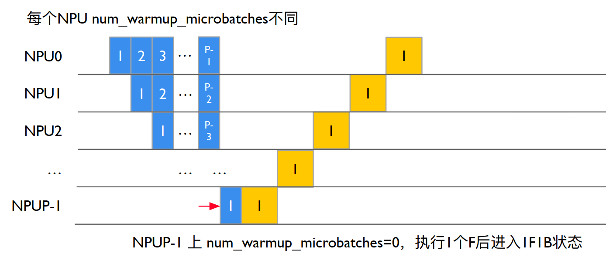

部分代码展示：
其中：num_microbatches：总的 micro batch 个数。num_warmup_microbatches：当前rank warmup阶段需要计算，直到1F1B 的microbatch的个数。
num_microbatches_remaining：当前rank还剩下多少个microbatch执行才到1F1B阶段，即num_microbatches - num_warmup_microbatches。
```
Megatron-LM/megatron/core/pipeline_parallel/schedules.py

def forward_backward_pipelining_without_interleaving(
    ...
    micro_batch_size: int,
    ...
):
    ...
    disable_grad_sync()

    # Compute number of warmup microbatches.
    num_warmup_microbatches = (
        parallel_state.get_pipeline_model_parallel_world_size()
        - parallel_state.get_pipeline_model_parallel_rank()
        - 1
    )
    num_warmup_microbatches = min(num_warmup_microbatches, num_microbatches)
    num_microbatches_remaining = num_microbatches - num_warmup_microbatches
```

- NPU0完成前向计算，如图所示：
NPU0在stage0阶段没有其它的Stage激活输入，因此忽略recv_forward()函数，forward_step调用 forward_step_func 真正调用模型执行：
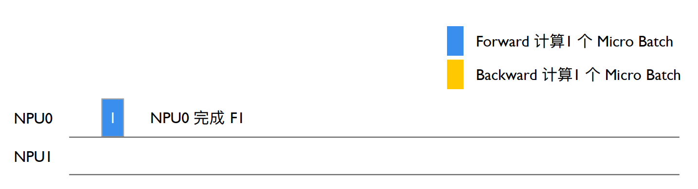

```
Megatron-LM/megatron/core/pipeline_parallel/schedules.py

 # Run warmup forward passes.
    for i in range(num_warmup_microbatches):
        # Decide to checkpoint all layers' activations of the current micro-batch
        if max_outstanding_backprops is not None:
            checkpoint_activations_microbatch = (
                i % max_outstanding_backprops
                >= config.num_microbatches_with_partial_activation_checkpoints
            )
        else:
            checkpoint_activations_microbatch = None

        input_tensor = recv_forward(
            recv_tensor_shapes, config, parallel_state.is_pipeline_first_stage()
        )
        output_tensor, num_tokens = forward_step(
            forward_step_func,
            data_iterator,
            model,
            num_microbatches,
            input_tensor,
            forward_data_store,
            config,
            collect_non_loss_data,
            checkpoint_activations_microbatch,
            check_first_val_step(first_val_step, forward_only, i == 0),
            current_microbatch=i,
            encoder_decoder_xattn=encoder_decoder_xattn,
        )

        def forward_step(...)
            ...
            if config.enable_autocast:
                context_manager = torch.autocast("cuda", dtype=config.autocast_dtype)
            else:
                context_manager = contextlib.nullcontext()
            with context_manager:
                if checkpoint_activations_microbatch is None:
                    output_tensor, loss_func = forward_step_func(data_iterator, model)
                else:
                    output_tensor, loss_func = forward_step_func(
                        data_iterator, model, checkpoint_activations_microbatch
                    )
```
- NPU0前向传递激活，如图所示：
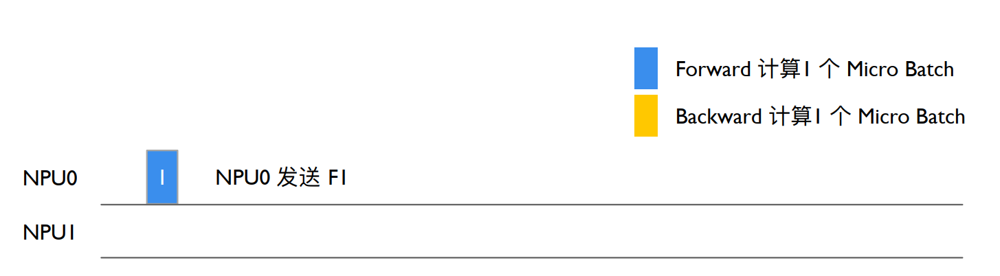
NPU0上输出Stage0 output_tensor后send_forward发送给下一个Stage，通过P2P_communication.send_forward发送output_tensor，通过torch.distributed.P2POp异步send output_tensor，最后调用 torch.cuda.synchronize() 执行同步
```
Megatron-LM/megatron/core/pipeline_parallel/schedules.py

        send_forward(
            output_tensor, send_tensor_shapes, config, parallel_state.is_pipeline_last_stage()
        )

        def send_forward(output_tensors, tensor_shapes, config, is_last_stage):
    """Wrapper for p2p_communication.send_forward used with non-interleaving schedule."""
    if not isinstance(output_tensors, list):
        output_tensors = [output_tensors]
    for output_tensor, tensor_shape in zip(output_tensors, tensor_shapes):
        if tensor_shape is None:
            continue
        p2p_communication.send_forward(output_tensor, config, is_last_stage)

Megatron-LM/megatron/core/pipeline_parallel/p2p_communication.py

      if wait_on_reqs and len(reqs) > 0:
        for req in reqs if isinstance(reqs, list) else reqs.values():
            req.wait()
        reqs = None

    if (
        (config.batch_p2p_comm and config.batch_p2p_sync)
        # The lists below have a size > 1 only when ETP ≠ DTP,
        # meaning this synchronization is required when ETP ≠ DTP.
        or len(tensor_recv_prev_list) > 1
        or len(tensor_recv_next_list) > 1
    ):
        # To protect against race condition when using batch_isend_irecv().
        # User should assert that we have a modern enough PyTorch to not need this
        torch.cuda.synchronize()    
```

- NPU0继续计算：
NPU0继续执行forward_step,Stage0前向计算得到第二个output_tensor,利用sedn_forward_recv_backward函数发送output_tensor等待backward，进入1F1B状态，通过send_backward_recv_backward底层试下通过P2PPp异步，send output_tesnor，且异步recv tensor_recv_next，最后调用synchronize()等待recv backward，NPU0进入等待状态。
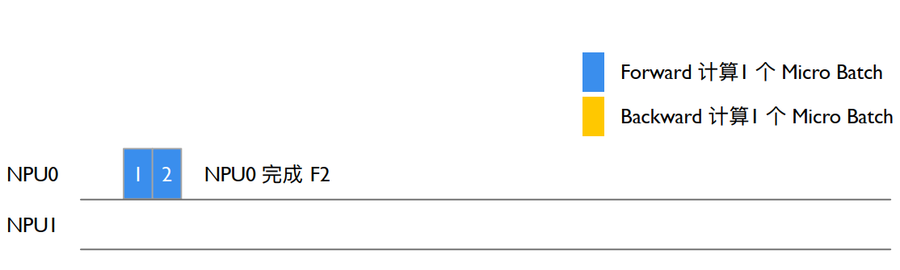

```
Megatron-LM/megatron/core/pipeline_parallel/schedules.py

def forward_backward_pipelining_without_interleaving(...):
 def enable_grad_sync():
    # Run warmup forward passes.
    for i in range(num_warmup_microbatches):
        # Decide to checkpoint all layers' activations of the current micro-batch
        if max_outstanding_backprops is not None:
            checkpoint_activations_microbatch = (
                i % max_outstanding_backprops
                >= config.num_microbatches_with_partial_activation_checkpoints
            )
        else:
            checkpoint_activations_microbatch = None

        input_tensor = recv_forward(
            recv_tensor_shapes, config, parallel_state.is_pipeline_first_stage()
        )
        output_tensor, num_tokens = forward_step(
            forward_step_func,
            data_iterator,
            model,
            num_microbatches,
            input_tensor,
            forward_data_store,
            config,
            collect_non_loss_data,
            checkpoint_activations_microbatch,
            check_first_val_step(first_val_step, forward_only, i == 0),
            current_microbatch=i,
            encoder_decoder_xattn=encoder_decoder_xattn,
        )
```

- NPU1进行前向计算：
其过程同GPU0一致，如图所示：
num_warmup_microbatches=0，进入1F1B状态，num_microbatches_remaining=3，recv_forward 调用 P2POp 异步recv，NPU1 最后调用synchronize() 执行同步等待 NPU0 Stage0 输出，从而保证NPU0 to NPU1 的执行顺序。
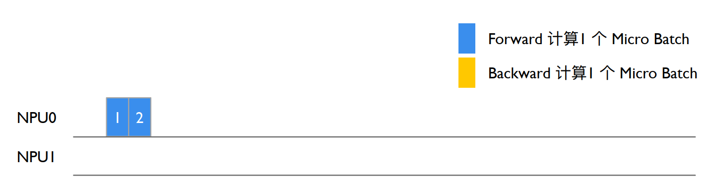
NPU1 recv_forward等待NPU0 Stage0发送intput_tensor后NPU1 forward_step设置iNPUt_tensor，实现NPU0&NPU1交换输入输出NPU1进入1F1B循环，forward_step_func调用GPTModel执行前向计算。NPU1 上TransformerBlock 执行第一个 Stage，Pre_process=False，即不会把iNPUt_embeddings作为ransformer的输入，使用NPU0 Stage0输入的iNPUt_tensor作为输入执行得到output tensor。
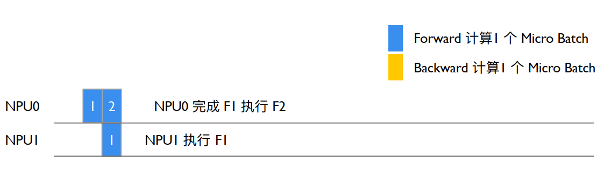
```
Megatron-LM/megatron/core/transformer/transformer_block.py

class TransformerBlock(MegatronModule):
    """Transformer class."""

    def __init__(
        self,
        config: TransformerConfig,
        spec: Union[TransformerBlockSubmodules, ModuleSpec],
        post_layer_norm: bool = True,
        pre_process: bool = False,
        post_process: bool = True,
        model_comm_pgs: ModelCommProcessGroups = None,
        vp_stage: Optional[int] = None,
    ):
        super().__init__(config=config)

        self.submodules = _get_block_submodules(config, spec, vp_stage)
        self.post_layer_norm = post_layer_norm
        self.pre_process = pre_process
        self.post_process = post_process
        self.vp_stage = vp_stage

    def forward(...):
        if not self.pre_process:
            # See set_input_tensor()
            hidden_states = self.input_tensor
```
示例中NPU1 Stage1是最后一层Staege，因此post_process=True,执行 is_pipeline_last_stage计算GPT模型的output_tensor和loss。

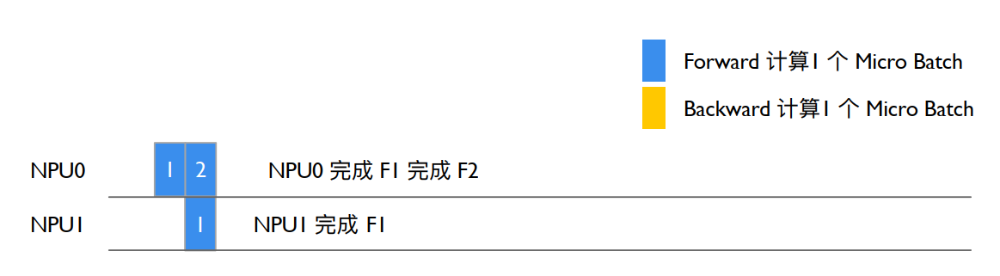

```
Megatron-LM/megatron/core/transformer/transformer_block.py

class TransformerBlock(MegatronModule):
    """Transformer class."""

    def __init__(
        self,
        config: TransformerConfig,
        spec: Union[TransformerBlockSubmodules, ModuleSpec],
        post_layer_norm: bool = True,
        pre_process: bool = True,
        post_process: bool = True,
        model_comm_pgs: ModelCommProcessGroups = None,
        vp_stage: Optional[int] = None,
    ):

Megatron-LM/megatron/core/pipeline_parallel/schedules.py

def forward_step(...)
    ...
   if parallel_state.is_pipeline_last_stage(ignore_virtual=False, vp_stage=vp_stage):
        if not collect_non_loss_data:
            outputs = loss_func(output_tensor)
            if len(outputs) == 3:
                output_tensor, num_tokens, loss_reduced = outputs
                if not config.calculate_per_token_loss:
                    output_tensor /= num_tokens
                    output_tensor /= num_microbatches
            else:
                # preserve legacy loss averaging behavior (ie, over the number of microbatches)
                assert len(outputs) == 2
                output_tensor, loss_reduced = outputs
                output_tensor *= parallel_state.get_context_parallel_world_size()
                output_tensor /= num_microbatches
            forward_data_store.append(loss_reduced)
        else:
            data = loss_func(output_tensor, non_loss_data=True)
            forward_data_store.append(data)
```

- NPU1反向执行Stage1：
执行完forward_step后执行backward_step得到iNPUt_tensor_grad，并
进入1F1B状态，执行send_backward_recc_forward->_communication->异步发送iNPUt_tensor_grad给NPU0并等待NPU0发送下一个MB forward结果。

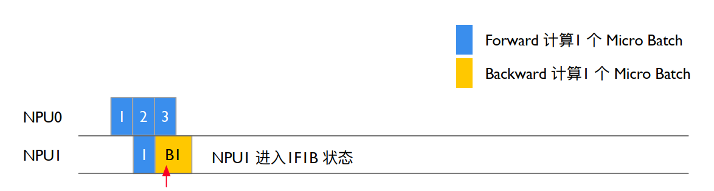

```
Megatron-LM/megatron/core/pipeline_parallel/schedules.py

def forward_backward_pipelining_without_interleaving(...):
    # Enable grad sync for the last microbatch in the batch if the full
    # backward pass completes in the 1F1B stage.
    if num_warmup_microbatches == 0 and last_iteration:
        if config.grad_sync_func is None or rank == 0:
            enable_grad_sync()

    input_tensor_grad = backward_step(
        input_tensor, output_tensor, output_tensor_grad, model_type, config
    )

    if last_iteration:
        input_tensor = None
        send_backward(
            input_tensor_grad,
            recv_tensor_shapes,
            config,
            parallel_state.is_pipeline_first_stage(),
        )
    else:
        input_tensor = send_backward_recv_forward(
            input_tensor_grad,
            recv_tensor_shapes,
            config,
            parallel_state.is_pipeline_first_stage(),
        ) 

def send_backward_recv_forward(input_tensor_grads, tensor_shapes, config, is_first_stage):
    """Wrapper for p2p_communication.send_backward_recv_forward used
    with non-interleaving schedule."""
    if not isinstance(input_tensor_grads, list):
        input_tensor_grads = [input_tensor_grads]
    input_tensors = []
    for input_tensor_grad, tensor_shape in zip(input_tensor_grads, tensor_shapes):
        if tensor_shape is None:
            input_tensors.append(None)
            continue
        input_tensor = p2p_communication.send_backward_recv_forward(
            input_tensor_grad, tensor_shape, config, is_first_stage
        )
        input_tensors.append(input_tensor)
    return input_tensors
```

- NPU0反向执行Stage0：
NPU0 Srage0等待send_backward_recv_forward被唤醒后获得NPU1 Staege1发送的output_tensor_grad，NPU0 Stage0执行backward_step输出intput_tensor_grad，NPU0计入1F1B状态，NPU0 num_warmup_mbs=1, num_mbs_remaining=2，进入1F1B循环，执行forward_step执行Starge1前向计算得到output_tensor(Forward 3)，执行send_forward_recv_backward发送output_tensor等待backward，异步recv tensor_recv_next，调用synnchronize()同步等待backward，NPU0 进入等待状态。

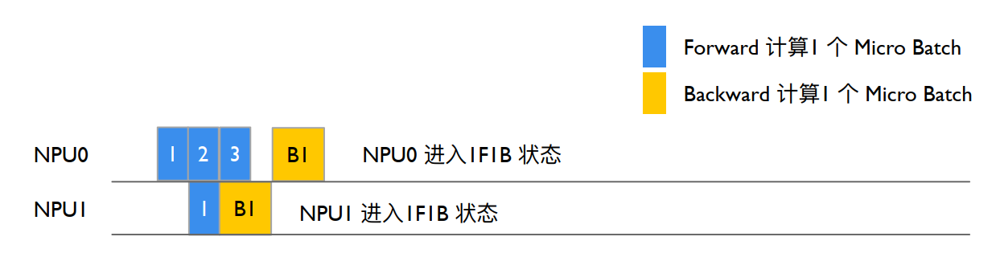

```
Megatron-LM/megatron/core/pipeline_parallel/schedules.py

 # Run 1F1B in steady state.
    for i in range(num_microbatches_remaining):
        last_iteration = i == (num_microbatches_remaining - 1)

        # Decide to checkpoint all layers' activations of the current micro-batch
        if max_outstanding_backprops is not None:
            checkpoint_activations_microbatch = (
                (i + num_warmup_microbatches) % max_outstanding_backprops
            ) >= config.num_microbatches_with_partial_activation_checkpoints
        else:
            checkpoint_activations_microbatch = None

        output_tensor, num_tokens = forward_step(...)
        total_num_tokens += num_tokens

        if forward_only:
            send_forward(
                output_tensor, send_tensor_shapes, config, parallel_state.is_pipeline_last_stage()
            )

            if not last_iteration:
                input_tensor = recv_forward(
                    recv_tensor_shapes, config, parallel_state.is_pipeline_first_stage()
                )

        else:
            output_tensor_grad = send_forward_recv_backward(
                output_tensor, send_tensor_shapes, config, parallel_state.is_pipeline_last_stage()
            )


Megatron-LM/megatron/core/pipeline_parallel/p2p_communication.py

  if recv_prev:
        if config.pipeline_dtype is None:
            raise RuntimeError("pipeline_dtype must be provided if recv_prev is True")
        if tensor_shape is None:
            raise RuntimeError(
                "tensor_shape must be specified if recv_prev is True. "
                "Common tensor_shape is (seq_length, micro_batch_size, hidden_size)"
            )
        tensor_recv_prev_func = create_tensor_recv_prev

    if recv_next:
        if config.pipeline_dtype is None:
            raise RuntimeError("dtype must be provided if recv_next is True")
        if tensor_shape is None:
            raise RuntimeError(
                "tensor_shape must be specified if recv_next is True. "
                "Common tensor_shape is (seq_length, micro_batch_size, hidden_size)"
            )
        tensor_recv_next_func = create_tensor_recv_next
```

- NPU1反向执行Stage1：
同理，NPU1 Stage1上执行send_backward_recv_forward同步等待收到NPU0
Stge0发送iNPUt_tensor（Forward 2）,NPU1 Stage1将iNPUt_tensor（Forward 2）作为TransformerBlock执行forward_step,得到输出output_tensor。


- NPU0执行Stage0
NPU0等待send_forward_recv_backward执行NPU1输出output_grad(B2)，执行backward_step输出iNPUt_tensor_grad（B2），NPU0 num_warmup_mbs=1, num_mbs_remaing=2, i=2，退出 1F1B，进入cooldown backwrd pass enable_grad_sync打开模型梯度更新，recv_backward等待NPU1发送最后一个 mbs 的backward（B3），NPU0 准备更新模型的梯度和参数。
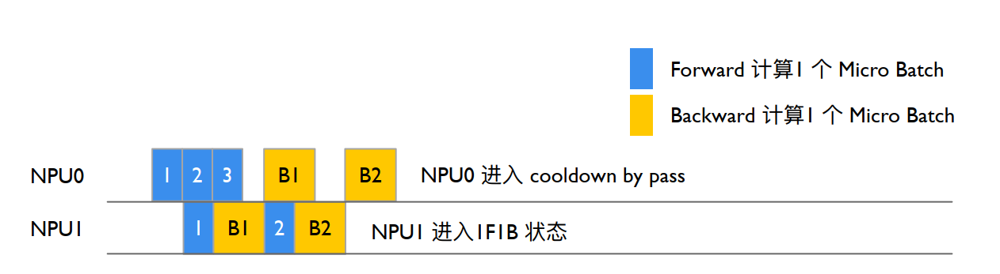

- NPU1执行Stage1
NPU1 Stage1执行send_backward_recv_forward同步等待iNPUt(F3),NPU1 num_warmup_mbs=0，num_mbs_remaining=3，进入1F1B循环,将NPU0 Stage0发送 iNPUt(F3)作为TransformerBlock的iNPUt计算前向,forward_step()输出output (F3)执行backward_step()得到iNPUt_tensor_grad(B3),send_backward()异步发送iNPUt_tesnor_grad(B3)给NPU0。
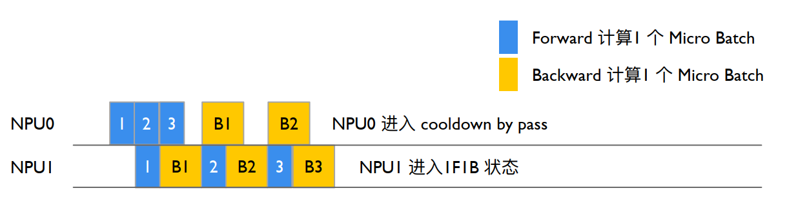

- NPU0执行Stage0后，执行完完整的iteration
NPU0等待cooldown backward的recv_backward()获得NPU1输出(B3)，执行 backward_step()输出iNPUt_tensor_grad(B3)，forward_backward_func()返回LOSS，enable_grad_sync()累加更新模型梯度，finalize_model_grads_func()更新模型参数。
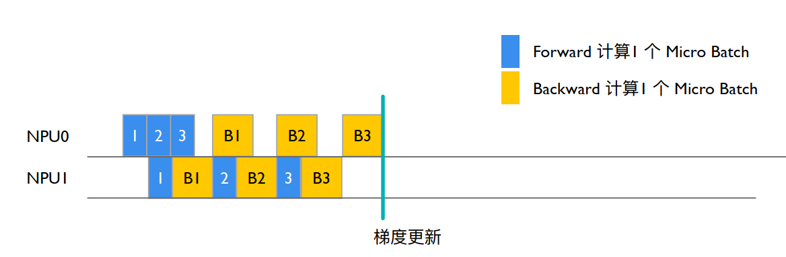

```
Megatron-LM/megatron/core/pipeline_parallel/schedules.py

def get_forward_backward_func():
  pipeline_model_parallel_size = parallel_state.get_pipeline_model_parallel_world_size()
    if pipeline_model_parallel_size > 1:
        if parallel_state.get_virtual_pipeline_model_parallel_world_size() is not None:
            forward_backward_func = forward_backward_pipelining_with_interleaving
        else:
            forward_backward_func = forward_backward_pipelining_without_interleaving
    else:
        forward_backward_func = forward_backward_no_pipelining
    return forward_backward_func


def forward_backward_pipelining_without_interleaving(...)
    def enable_grad_sync():
        output_tensor_grad = recv_backward(
                        send_tensor_shapes, config, parallel_state.is_pipeline_last_stage()
                    )

                    input_tensor_grad = backward_step(
                        input_tensor, output_tensor, output_tensor_grad, model_type, config
                    )

                    send_backward(
                        input_tensor_grad,
                        recv_tensor_shapes,
                        config,
                        parallel_state.is_pipeline_first_stage(),
                    )

                # Launch any remaining grad reductions.
                if no_sync_context is not None:
                    enable_grad_sync()
                    if config.grad_sync_func is not None:
                        config.grad_sync_func(model.parameters())

            if config.finalize_model_grads_func is not None and not forward_only:

                # If defer_embedding_wgrad_compute is enabled we need to do the
                # weight gradient GEMM's here.
                finish_embedding_wgrad_compute(config, embedding_module)

                # Finalize model grads (perform full grad all-reduce / reduce-scatter for
                # data parallelism, layernorm all-reduce for sequence parallelism, and
                # embedding all-reduce for pipeline parallelism).
                config.finalize_model_grads_func(
                    [model], total_num_tokens if config.calculate_per_token_loss else None
                )

            if config.timers is not None:
                config.timers('forward-backward').stop()

            if hasattr(config, 'enable_cuda_graph') and config.enable_cuda_graph:
                create_cudagraphs()

            return forward_data_store
```

## 参考文献：
https://zhuanlan.zhihu.com/p/650744349
https://zhuanlan.zhihu.com/p/701716465
https://blog.csdn.net/just_sort/article/details/135981391
https://blog.csdn.net/HaoBBNuanMM/article/details/134095326
https://github.com/NVIDIA/Megatron-LM