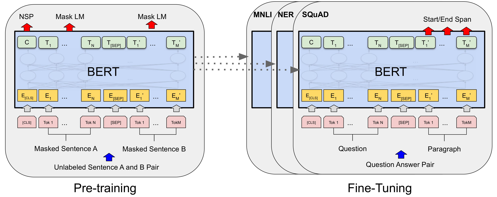

<!--Copyright © ZOMI 适用于[License](https://github.com/Infrasys-AI/AIInfra)版权许可-->

# 大模型微调基础

> Author by: 许起星

在人工智能快速发展的背景下，大模型展现出强大的通用能力，能够理解自然语言、掌握常识知识，甚至具备一定的逻辑推理能力。这些模型经过大规模数据训练，已经成为具备通用智能的基础系统，广泛应用于各类任务中。

然而，这种强大的通用性也伴随着一个固有的局限：它们对任何特定领域的理解都不是最深入的。一个通用的语言模型，就像一位知识渊博的通识学者，涉猎广泛，但并非特定领域的专家。对于某些需要深入领域知识的场景，比如法律咨询、风格化写作，或企业级客户服务，通用模型往往难以满足实际需求。这也暴露出一个关键问题：模型“懂得很多”，但缺乏“针对性”。

在实际应用中，我们往往需要的是专家。我们需要一个能理解医学术语的临床诊断助手，一个熟悉法律条文的合同审查工具，或是一个能模仿特定品牌语气的市场文案撰写AI。如何弥合通用模型的基础能力与特定应用场景的专业需求之间的鸿沟？这正是“微调”（Fine-tuning）技术所要解决的核心问题。微调并非创造一个全新的模型，而是基于一个已经训练好的通用模型，利用与特定任务相关的较小规模数据，对其进行针对性地再训练，从而使模型的能力与特定目标对齐。这可以理解为在一个通用模型上，补充“专业课”，让它从“通才”转向“专才”，符合人们实际的需要。

本章将系统介绍微调的基础知识，包含其起源、主流微调方法、大模型基本的训练流程和微调的典型应用场景，帮助读者理解如何将通用模型转化为面向特定任务的实用工具，同时讨论微调过程中面临的挑战与解决思路。

## 微调的起源

每一场技术革命，都源于对现有困境的深刻洞察与不懈突破，而微调范式的确立，正是人工智能领域一场影响深远的思想与工程革命。要理解微调的价值，我们有必要回溯它的源头，探寻这一范式是如何在技术演进的浪潮中应运而生的。在本小节中，我们以自然语言领域为背景，从“迁移学习”（Transfer Learning, TL）的角度，将微调的发展娓娓道来。

### 孤岛时代

在人工智能的早期发展阶段，特别是在自然语言处理（NLP）领域，模型的构建遵循一种“各自为战”的模式。每个特定的任务，无论是文本分类、情感分析还是机器翻译，都需要从零开始训练一个专门的模型 。这些早期模型主要依赖于基于规则的系统或传统的统计方法 。基于规则的方法需要语言学专家手动编写大量的语法和语义规则，这种方式不仅耗时耗力，而且泛化能力极差，难以适应语言的复杂性和多变性。随着统计方法的兴起，模型开始从数据中学习模式，但它们依然是任务隔离的，为一个任务学习到的知识无法被另一个任务所利用 。这种独立训练的模式在当时是符合逻辑的，但也带来了三个难以回避的根本性问题。

首先，**模型对数据重度依赖**。由于模型是从一张白纸开始学习，它对世界的全部认知都来源于所提供的训练数据。为了让模型达到可用的性能水平，必须为其准备规模庞大且经过精心标注的专属数据集。这在许多领域都意味着高昂的人工成本和时间成本，构成了应用落地的一道高墙。

其次，**已学习到的知识难以迁移**。在为一个任务（例如，训练一个新闻分类器）投入大量资源训练好一个模型后，其学到的关于语言的语法、语义等知识，被完全固化在了这个模型的参数之中。当开始一个新任务时（例如，训练一个电影评论的情感分析器），上一个模型的知识财富无法被继承。每一个新项目都意味着一次“另起炉灶”，导致了整个领域内系统性的效率低下和资源浪费。

最后，随之而来的是**高昂的训练成本**。每一个模型的独立训练都要求完整的计算资源投入，这不仅拖慢了研究和开发的迭代速度，也使得高性能NLP技术的实践在很大程度上局限于少数拥有雄厚计算资源和数据积累的机构。

### 迁移学习

面对独立训练模式的种种局限，学术界和工业界的研究者们开始探寻一种更高效的路径。一个自然而然的想法是，既然人类在学习新技能时会利用已有的知识，那么机器是否也能做到这一点？这一思考，催生了“迁移学习”思想的逐步演进。

迁移学习的核心理念，是将从一个任务（源任务）中学到的知识，应用于解决另一个不同但相关的任务（目标任务）。这一概念并非凭空出现，其思想根源可以追溯到心理学中关于学习迁移的研究。在机器学习领域，关于神经网络中迁移学习的正式探讨最早出现在1976年Bozinovski和Fulgosi的论文中，他们提出了该课题的数学和几何模型 。在NLP的早期探索中，这通常表现为使用在一个大型语料库上训练出的词向量（如Word2Vec、GloVe）。这些预先训练好的词向量捕捉了词语之间丰富的语义关系，当把它们作为下游任务模型的输入特征时，相当于为模型注入了基础的语言知识，使其不再需要从零开始学习词语的含义。它的价值在于其高效性，尤其是在目标任务数据稀缺的情况下，模型通过利用在大型数据集上预先学到的通用知识（例如，图像中的边缘、纹理特征，或语言中的语法、语义结构），在面对新任务时不再需要从随机状态开始学习，而是**站在巨人肩上**去学习。这不仅能显著减少对标注数据的依赖，**降低数据门槛**，还能节省大量的计算资源和训练时间 。

这一步虽然意义重大，但它仅仅迁移了相对浅层的词汇知识。模型的更高层网络，即负责理解句子结构、上下文和复杂语义的部分，依然需要从头学习。研究者们很快意识到，如果能将整个模型的知识都进行迁移，效果可能会远超预期。于是，使用在一个大型通用任务（如语言建模）上完整训练的模型作为起点，再针对特定任务进行后续训练的思路开始出现。这些早期的探索虽然方向正确，但往往缺乏一套系统、稳定且能带来显著提升的方法论，直到2018年，真正的突破才到来。

### 预训练-微调

2018年是现代NLP发展史上的分水岭。以ULMFiT和BERT为代表的一系列工作，不仅在多个NLP基准测试中取得了突破性的成果，更重要的是，它们共同将“预训练-微调”塑造成了一个清晰、高效且可复制的标准化范式，并使其迅速成为领域内的主流。

ULMFiT首次系统性地展示了一套完整的语言模型微调方法，证明了通过精心设计的技术（如判别性学习率和逐层解冻），可以在数据相对较少的情况下，取得非常出色的任务表现。它为后续的工作提供了宝贵的思想启蒙和技术铺垫。

紧随其后的BERT，则凭借其创新的Transformer架构和深刻的双向预训练任务（Masked Language Model），将这一范式的潜力发挥到了极致。BERT的巨大成功，及其简洁明了的应用流程，使其迅速被广为采纳。“预训练-微调”自此不再仅仅是一种可行的技术思路，而是成为了开发高性能NLP模型的首选路径和黄金标准。

这一新范式将模型开发清晰地划分为两个阶段：

- **第一阶段：预训练（Pre-training）。** 在这个阶段，模型在庞大的、无特定任务标签的通用文本（如维基百科、各类网页）上进行训练。其目标并非解决任何具体问题，而是学习语言本身内在的规律，包括词汇、语法、语义关系和一定程度的世界知识。这个过程产出的是一个强大的通用基础模型，它如同一个完成了通识教育的大学毕业生，具备了广博的知识背景和学习能力。
- **第二阶段：微调（Fine-tuning）。** 在这个阶段，我们针对一个具体的下游任务（如情感分析），使用该任务专属的、规模相对较小的标注数据，对预训练好的模型进行进一步的训练。这个过程相当于为那位“大学毕业生”提供专业方向的在职培训。由于模型已经具备了深厚的语言基础，微调过程通常非常高效，只需对模型的参数进行“微小调整”，就能使其迅速掌握新任务的要领。

“预训练-微调”范式的确立，从根本上解决了独立训练时代的三个核心困境。它提供了一个强大的起点，不再“从零开始”；它使得从通用数据中学到的知识得以高效迁移，打破了“知识孤立”；它也因此极大地降低了对下游任务标注数据的依赖，缓解了“数据饥渴”的问题。这场深刻的变革，为之后更大规模、更强能力的语言模型的出现和应用，铺平了坚实的道路。

## 主流微调方法

## 大模型训练流程

## 微调使用场景

## 小结与思考

- 
