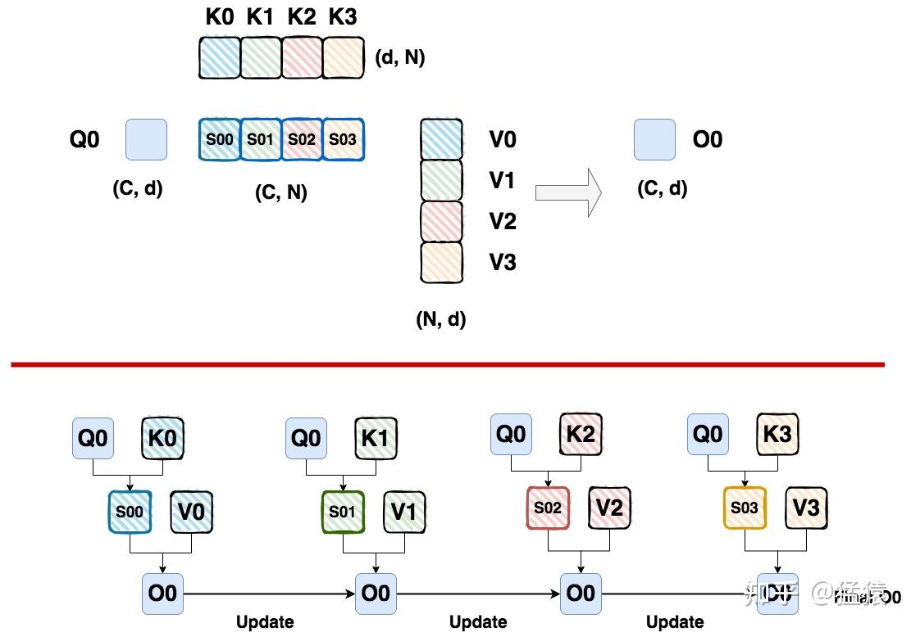
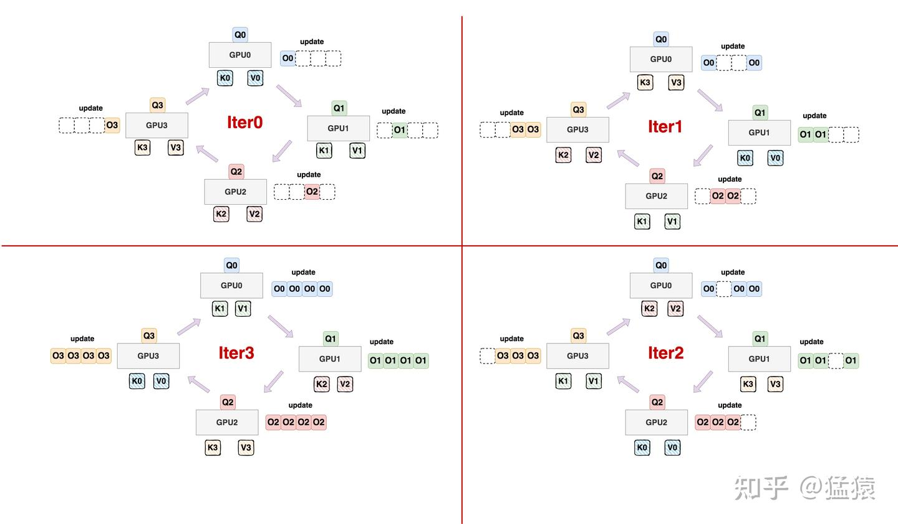

# Ring Attention
Author by: 付溦崴

Ring Attention 将一段序列放到多张卡上进行计算，每张卡保存 $Q$、$K$、$V$ 矩阵的一部分，通过环状通信在多卡之间发送/接受新的 $K$、$V$ 矩阵 block，达到更新注意力输出的目的。Ring Attention除了对 Attention 进行多卡分块计算，还将 FFN 层进行多卡分块计算，因此 Ring Attention 本质上就是分布式版本的 BPT（Blockwisew Parallel Transformers），可以简单地将两者与 Flash Attention2 的关系理解为：Flash Attention2->BPT(Flash Attention2 + 分块 MLP)->Ring Attention(分布式版本的 BPT)。

## Attention 分块计算
我们假设 $Q$、$K$、$V$ 矩阵的尺寸均为（N，d），其中 N=seq_len，d=hidden_size，为简单起见，我们将序列切分为 4 个 chunk（假设我们有 4 张卡，每张卡负责一个 chunk），每个 chunk 大小为（C，d），如下图所示：

每个块的注意力输出 $O_i$ 需要用到 $Q_i$ 矩阵（1 个 chunk）和所有的 $K$ 矩阵和 $V$ 矩阵（所有 chunk），因此在多卡计算的时候每张卡的 $Q_i$ 是固定的。在每块 GPU 上的计算流程是：
- 传入 $K_j$ 以及 $V_j$；
- 计算 $Q_i$ 与 $K_j$ 的注意力分数 $S_{i,j}$；
- 计算 $S_{i,j}$ 与 $V_j$ 的矩阵乘法，得到 $O_i^j$；
- 传入其他 $K$、$V$ 矩阵的 chunk，重复上述过程，更新得到最后的 $O_i$。

上述过程如下图所示：

这里需要注意的是 $O_i$ 是如何更新的。由于注意力机制需要对注意力分数矩阵做 softmax，因此我们需要获得分数矩阵每行的全局最大值以及 sum，记作 global max 和 global sum，但我们在分块计算的过程使用是 local max 以及 local sum。Ring Attention 更新 $O_i$ 的方式与 Flash Attention2 基本一致。

## 多 GPU 环状通信
上面的分块流程已经提及，每次计算得到的 $O_i^j$ 只需要用到 $K_j$ 以及 $V_j$，因此每张 GPU 仅仅保留对应需要的 chunk，在下一次更新 $O_i^{j+1}$ 的时候需要从其他卡接收 $K_{j+1}$ 以及 $V_{j+1}$，这样就能够达到节约显存的目的。不过需要注意的是，这个过程会增加通信量，因此需要设计合理的 chunk size，使得计算与通信的时间相互遮盖。下面是环状通信的流程：

- 首先将 $Q$ 分块放置到每张 GPU 内，各卡上的 $Q$ 分块不变；
- 接着，每块卡上只放一块 $(K，V)$ 对。也就是每次计算时，哪个 $(K，V)$ 对需要被这块卡用到，哪个 $(K，V)$ 对就在这块卡上放着。初始化的状态如图iter0所示；
- 接着，在每块卡使用当前 $(K，V)$ 对做Attention计算时:
    - 接收来自前一块卡的 $(K，V)$ 对，并把自己当前维护的 $(K，V)$ 对发给下一张卡，形成一个环状通信拓扑
    - 例如，当 GPU0 正在使用 $(K_0，V_0)$ 进行计算时，它接收来自 GPU3 的 $(K_3，V_3)$ ，同时把自己的 $(K_0，V_0)$ 发送给 GPU1，其余卡也是类推。

在我们的图中，为了更好表示这一个更新过程，对于某个 $O_i$ 我们画出了若干个，但正如上文所说，实际运行时我们只维护一个 $O_i$ 并不断更新它。这里画出多个 $O_i$ 只是更好帮助大家理解。

## 显存分析
这里不考虑 FFN 层分块的影响，仅对 Attention 显存占用进行分析，精度假设为 bf16：每张卡需要保存一个 $Q_i$，$K_j$，$V_j$ 来计算当前的 $O_i^j$，占用 6Cd bytes；还需要保存获取从前一张 GPU 上获取的 $K_{j-1}$、$V_{j-1}$ 占用 4Cd bytes；计算更新过程中需要保存当前的 $O_i^j$ 占用 2Cd bytes，因此总共占用 12Cd bytes。

## Chunk Size 设置
为了不影响效率，设置的原则是【传输时间 <= 计算时间】，这样才可以让这部分开销被计算覆盖住，进而不影响整个系统的计算效率。而要做到这一点，就需要我们根据所使用的卡的配置，设计好最优的分块大小，也就是上图中所说的 C（chunk size），用于表示一个分块中包含多长的序列。为了表达简便，我们在做各种指标计算时忽略掉batch_size维度。

我们假设：
- 硬件（例如单张 GPU）的算力上限是F，单位是 FLOPS 或者 FLOP/s。
- 硬件的带宽上限是B，单位是Byte/s。

单卡在对每个 chunk 进行计算的时候，计算 Attention score 的计算量为 $2dC^2$ FLOPs，Attention score 与 $V$ 矩阵相乘的计算量为 $2dC^2$ FLOPs，因此 Attention score 的整体计算量为 $4dC^2$ FLOPs。

传输数据（$K$，$V$分块）的通信总量为 $4dC$ bytes。根据【传输时间<=计算时间】的基本要求，我们有：
$\frac{4dC}{B} \leq \frac{4dC^2}{F}$，进一步可得：$C \geq \frac{F}{B}$，及我们根据硬件的算力和带宽得到的最优切块大小。

上面的推导过程中没有考虑 $W_Q$，$W_K$，$W_V$ 矩阵的映射的计算量，因此对 $C$ 的要求也是更严格的，因为这意味着要求在 Attention Score 的计算量下完成通信，而不是在实际情况 Attention score + Projection 的计算量下完成通信。

# Ulysses 长序列并行

# Hybrid Attention

 参考链接：

[Ring Attention with Blockwise Transformers for Near-Infinite Context](https://arxiv.org/abs/2310.01889)

[图解大模型训练系列：序列并行3，Ring Attention](https://zhuanlan.zhihu.com/p/4963530231)