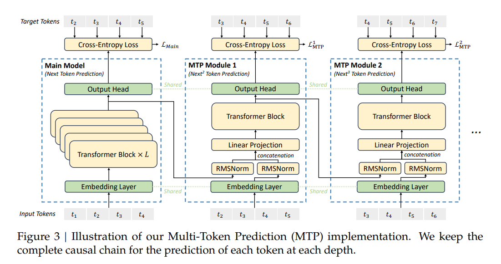
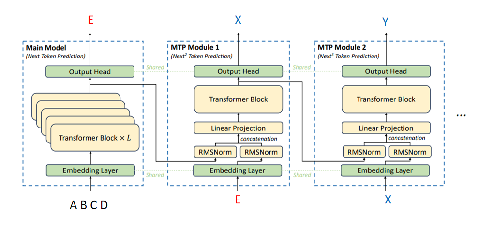
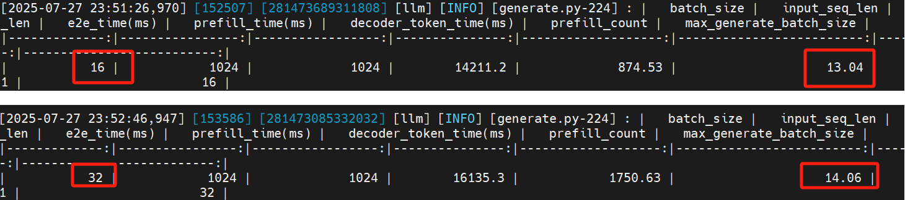

# Multi token prediction (MTP) 原理

Multi token prediction (MTP) 是《DeepSeek-V3 Technical Report》里面介绍的一种提升训推性能的技术，本质上也是一种投机采样技术。技术报告中给出的MTP推理图解如下所示：

上面的图是训练阶段的，我们修改一下，变成推理阶段的过程：

## 投机采样过程

如上图所示，MTP推理过程涉及多个模块，第一个模块是main model，也就是基本模型，比如deepseek V3/R1本身；第二个和第三个模块是MTP module。每个MTP module里面的transformer block都只有1层，这样的话，MTP module的推理时延相比main module的时延可以忽略。需要注意的是，MTP module的数量没有限制，上面的图例只画出了2个MTP module，也可以是1个或者3个、4个...。

我们来看一下具体的推理过程是怎样的。以上图为例，假如模型的输入token为`ABCD`，那么经过main model后，可以得到首token`E`；然后把`E`传给MTP module1的Embedding layer，同时把main model的最后一层hidden states 也传给MTP module，这样的话MTP module就推理得到`X`；同样，把`X`和MTP module1的hidden states给到MTP module2，输出`Y`。由于MTP module的执行耗时相比main model可以忽略不计，所以我们可以认为这个过程是1次推理，得到了`EXY`3个token，而传统的推理方式只能得到1个token。当然，由于`X`和`Y`都是通过MTP module推理得到的，它不一定符合main model的预测分布，所以我们还需要进行“validation”。

## validation过程

validation是这么做的：把`ABCDE`和`ABCDEX`组成一个batch，给main model进行推理。假如`main_model.forward(ABCDE)=F,main_model.forward(ABCDEX)=G`。那么我们要如下进行比较：

如果`X!=F`，那么说明我们投机采样得到的结果和原模型预测结果不一致，所以要舍弃`X`和`Y`，把`ABCDE`作为下一次推理的输入；

如果`X==F`，但是`Y!=G`，说明投机采样只猜对了1个token，这种情况下，我们就把`ABCDEFG`作为这一轮的输出。如果`X==F`且`Y==G`，说明投机采样猜对了2个token，这种情况下，我们把`ABCDEFG`作为这一轮的输出。

有同学可能发现了，这里不管`Y`有没有猜对，输出的token数量都是一样的。所以我们可以做如下改进。

## 改进

在做validation的时候，我们只用了main model做推理。在实际的工程实现中，为了实现更快的加速，在做validation的时候也会采用投机采样推理，我们用一个例子来说明。

假如我们现在只使用1个MPT module，模型的初始输入是`ABCD`。那么我们可以如下进行改进后的MTP推理：

step 1：完成main model和MTP module的推理，得到输出`E`和`X`；

step2：做validation，把`ABCDE`和`ABCDEX`作为输入，完成main model和MTP module的推理，假设分别得到`FG`和`YZ`；

step3：如果`X!=F`，那么就舍弃`X`和`Y`，把`ABCDE`作为本轮的输出，同时把`ABCDE`和`ABCDEF`作为输入，回到step2；如果`X==F`，那么就把`ABCDEFY`作为本轮的输出，同时把`ABCDEFY`和`ABCDEFYZ`作为输入，回到step2。

可以发现，除了计算首token的时候用到了step 1，在做增量计算的时候，只用到了step 2和step3。最坏的情况是，每次投机采样的结果都是错误的，这样的话，每轮推理（step2+step3）只能输出1个token，而且代价是推理的batch_size从1变成了2，所以相比不使用MTP性能会下降。最好的情况是，每次投机采样的结果都是对的，这样的话，每次可以输出2个token。有同学可能有疑问，最好情况下，推理的batch_size从1变成了2，造成的影响有多大？实际上，在增量推理的时候，算力一般不是瓶颈，时延增长不会很明显。以下是几组对比实验：

## 和传统投机采样推理的区别

传统的投机采样使用小模型（也称草稿模型，draft model，一般使用蒸馏模型）进行多token的预测，然后交给大模型进行validation。

| **对比维度**       | **投机采样推理（如EAGLE、SpecForge）** | **多令牌预测（MTP）**                  |
| ------------------ | -------------------------------------- | -------------------------------------- |
| **核心机制**       | 小模型草稿+大模型并行验证              | 主模型同时预测多个未来token            |
| **应用阶段**       | **推理阶段优化**（不修改主模型）       | **训练阶段修改**（需与主模型联合训练） |
| **训练要求**       | 草稿模型可独立训练（无需主模型参与）   | 需从头修改主模型架构与训练目标         |
| **输出分布一致性** | 严格保持主模型原始分布                 | 可能改变分布（需处理token间依赖）      |
| **加速效果**       | 显著（1.5–3倍，如SpecForge达2.18倍）   | 有限（约1.3倍）                        |
| **适用性**         | 灵活适配现有模型（如Llama、GPT）       | 依赖特定训练框架，难以迁移至开源模型   |

