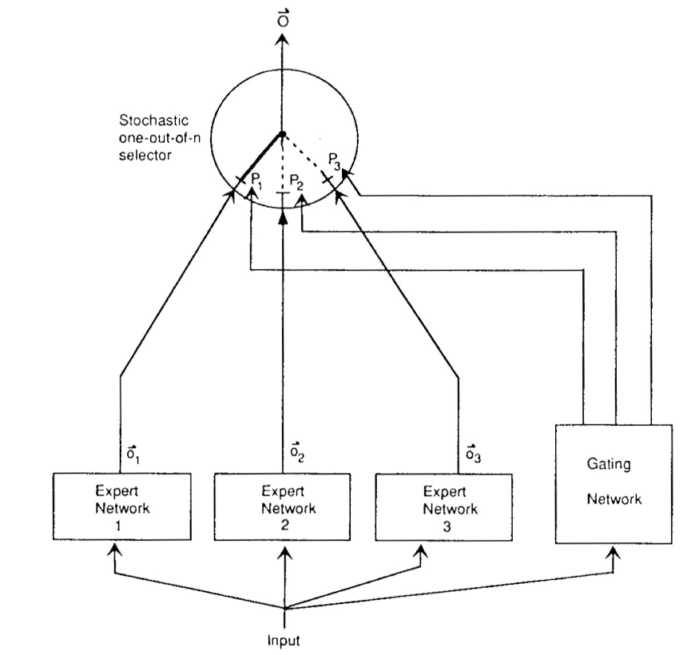

<!--Copyright © ZOMI 适用于[License](https://github.com/Infrasys-AI/AIInfra)版权许可-->

# MOE 奠基论文

Author by: 张晓天

1991年，当Jacobs等学者在发表 “Adaptive Mixtures of Local Experts” 这篇开创性论文时，神经网络研究正面临一个根本性困境：**灾难性干扰（Catastrophic Interference）**。传统单体模型在训练多任务时，新场景的权重更新会剧烈破坏已学得的旧场景表征。

传统共享权重的神经网络在处理多任务时会出现任务间干扰现象可以理解为，当网络根据任务B的梯度更新权重以提升其性能时，这些共享参数的改变会同时破坏网络对任务A已学习到的映射关系，导致任务A性能下降，这种参数空间的冲突使得多任务学习陷入"学得越多，忘得越快"的恶性循环，正如论文指出的"一个任务的学习会干扰其他任务所需的权重"。

## 多任务学习的困境

对于比较复杂的任务，一般可以拆分为多个子任务。比如要求计算输入文本中有多少个动词和名词，那就可以拆分为“数动词”和“数名词”这两个子任务。

而一个模型如果要同时学习多个子任务，多个子任务相互之间就会互相影响，模型的学习就会比较缓慢、困难，最终的学习效果也不好。

造成这种问题的根本原因是，传统单体模型**同时学习"动词计数"和"名词计数"时，优化名词计数的权重更新会破坏动词计数的权重映射，这使得模型参数空间必须同时编码两个互斥的特征表达模式。

因此文章提出了减弱干扰效应的方法，其**主要思路是设立多个互相独立的专家系统**（*Expert Network*, 以下简称*expert*）**，将一个复杂场景分割成多个特定场景，并由每个expert 独立的处理特定场景中的某个子任务，从而实现学习网络独立的权重更新。**

另外，作者设计了一个基于概率性模型的**门限网络**（*[Gating Network](https://zhida.zhihu.com/search?content_id=182229594&content_type=Article&match_order=1&q=Gating+Network&zhida_source=entity)*）。**基于*Gating*的输出，最终模型就能够选取最适合当前输入场景**（*input*）的expert或experts组合。如此，最终模型仍可以像传统模型一样完成复杂场景下的各种任务，且具有更强的泛化性。

文章里把这个MoE的方法应用于vowel discrimination task，即元音辨别任务，验证了MoE设计的有效性。元音辨别指的是语音学中区分不同元音的能力，在语音学中，模型需要学习辨别不同的元音因素，以便准确地理解和识别语音输入。通过让多个子模型分别学习分别学习不同元音（a、e、i、o、u）辨别的子任务，最终效果得到了提升。

## 从合作到竞争的范式转换

实际上，MoE这个idea在这篇文章之前就有了。如论文中所提，Jacobs和Hinton在1988就讨论过。但是之前的工作在loss的设计上，和ensemble更相近，多个expert之间更倾向于合作，每个expert会学习其他expert的residual部分。是把期望输出和所有expert输出的混合结果进行比较。

这样做的结果是，在训练过程中，每个expert学习的其实是其他expert的组合结果所剩下的残差。这样的学习目标并不能很好迫使每个expert单独输出好的结果，因此不能得到稀疏的模型。

从另一个角度来看，这个损失计算把所有专家耦合在了一起。即当一个expert的输出发生了变化，所有expert的组合结果也会变化，其他所有的expert也需要做相应的改动来适应这个变化。因此各个expert之间更加倾向于合作，而不是相互竞争并单独给出好的结果，让gating network输出稀疏的结果。

虽然可以使用如增加辅助损失函数的做法，迫使模型给出稀疏激活的结果，但是这样相当于增加了很强的先验正则化，对模型最终效果也是有损害的。

而Hinton和Jordan在这个工作里，提出更简单的做法是对loss计算进行修改，使得各个expert之间的关系从合作变成竞争。

在这个损失函数中，每个expert的输出结果会单独和期望结果进行对比，这就要求每个expert单独给出完整的结果，而不是仅学习其他expert的残差。这样的loss计算具有localization的特性，即如果一个训练case错了，那么会被修改的主要是被gating network选中且出错的expert，以及负责分配权重的gating network，而不会很大地影响其他expert。

这样一来，不同的expert之间不会直接相互影响，虽然还是有间接的影响，比如某个expert的输出变了，gating network可能会分配新的权重，但是至少不会改变其他expert error的符号（+，-），即优化的方向。最终的结果是，对于给定的输入，这样的系统会倾向于以高权重分配单一一个expert来预测结果。

$$
\begin{array}{c|c}
\text{合作式损失 (1988)} & \text{竞争式损失 (1991)} \\
\hline
L_{\text{coop}} = \left\| y - \sum_i g_i o_i \right\|^2 & L_{\text{comp}} = \sum_i g_i \| y - o_i \|^2 \\
\downarrow & \downarrow \\
\frac{\partial L}{\partial o_k} = 2g_k(\sum_j g_j o_j - y) & \frac{\partial L}{\partial o_k} = 2g_k(o_k - y) + 2\sum_{j\neq k} g_j(o_k - y) \\
\text{耦合更新} & \text{竞争梯度}
\end{array}
$$

**动力学解释**：

* 合作模式：专家k的梯度依赖于**所有专家输出的加权和**
* 竞争模式：专家k的梯度包含：
  1. **自身误差项**：$2g_k(o_k - y)$
  2. **竞争压力项**：$2\sum_{j\neq k} g_j(o_k - y)$

## 专家专业化

对于这个架构的训练，也就是相应的代价函数和如何整合experts和gating的输出，作者提出了两种思路，“赋予关联学习竞争性”和“赋予竞争学习关联性”。

### 赋予关联学习竞争性

**核心思想**：重新定义误差函数，让门控网络在每次选择时随机决定使用哪个单一的专家，而不是线性组合多个专家的输出。
新的误差函数定义为：

$$
E^{c} = \sum_{i} p_{i}^{c}\,\|\mathbf{d}^{c}-\mathbf{o}_{i}^{c}\|^{2}
$$

其中：

* 仍然保持 $p_i^c$代表门控网络选择专家 $i$ 的概率。
* 这个误差函数表示：对于每个可能的专家 $i$，以其被选择的概率加权，它单独产生的输出与期望输出之间的误差。
  **效果**：
* 每个专家独立地尝试对整个输出负责，而不只是去补偿其他专家留下的残差。
* 当某个专家在处理某个样本时表现优于其他专家，它获得的“责任”会增加，从而更多地参与到类似样本的学习中。

为了进一步改进效果，作者提出了一个变体的误差函数：

$$
E^{c} = -\log\sum_{i} p_{i}^{c}e^{-\frac{1}{2}\|\mathbf{d}^{c}- \mathbf{o}_{i}^{c}\|^{2}}
$$

此公式的优势在于：

* 在计算梯度时，会自然地更快地调整表现最佳的专家，而不是平均调整所有专家。
* 这通过一个$softmax$风格的权重机制，自动放大那些与期望输出更接近的专家的影响，鼓励更快地专精化。
  **具体效果**：
* 在训练早期，当所有专家的表现都较差时，新误差函数能更快地找到并调整最有潜力的专家。
* 这种机制减少了多个专家在同一个任务上的不必要竞争，使得一个专家更快地“专精”于某些数据区域。

### 赋予竞争学习关联性

背景：竞争学习通常用于无监督聚类，比如找到数据中的典型模式或中心（如聚类中心）。在传统的竞争学习中，每个隐藏单元代表一个聚类中心，数据点被分配到距离最近的中心。
**转换思路**：将竞争学习的思想引入到关联（即输入输出映射）的情境中，把竞争网络看作一个**生成输出向量的系统**，而不仅仅是对输入聚类。

1. **概率模型视角**：
   * 假设每个隐藏单元对应一个多维高斯分布，均值由该单元的权重向量决定。
   * 给定一个输出向量 $\mathbf{o}^c$，其生成概率可以表示为高斯混合模型的形式：

     $$
     \log P^c = \log \sum_i p_{i}k e^{-\frac{1}{2}\|\boldsymbol{\mu}_i - \mathbf{o}^c\|^2}
     $$

     * $\boldsymbol{\mu}_i$：隐藏单元 i 的权重向量，相当于高斯分布的均值
     * $p_i$：选择隐藏单元 i 的概率，称为混合比例
2. **软硬竞争学习**：
   * **软竞争学习**：根据整个概率分布调整所有单元的权重，使得训练数据的似然度最大化。
   * **硬竞争学习**：简化处理，只调整对给定数据点贡献最大的那个单元的权重。
3. **关联性引入**：
   * 将每个竞争学习的隐藏单元替换为一个专家网络，使得该网络的输出（而非固定权重）决定高斯分布的均值。
   * 引入门控网络，使得混合比例 pi 依赖于输入向量，而不再是常数。
   * 结果是一个输入-输出映射系统：给定输入后，门控网络决定调用哪个专家网络，而该专家网络生成输出。

**意义**：

* 这种设置把传统的竞争学习（无监督）与监督学习结合起来，构建了一个能够根据输入生成适当输出的系统。
* 专家网络不仅仅是简单的固定聚类中心，而是可以根据输入动态调整输出，提供更灵活的映射能力。

## 元音辨识实验

在元音辨识实验中，论文通过精心设计的对比研究，验证了MoE框架的优越性。实验选择英语元音（a/e/i/o/u）作为分类目标，这一任务具有天然的可分性特征，为验证专家分工机制提供了理想场景。

研究团队设置了三种对比条件：传统单体网络、早期合作式MoE和本文提出的竞争式MoE。实验数据显示，竞争式MoE展现出显著优势——其91.7%的准确率不仅超越单体网络近10个百分点，较合作式MoE也提升6.6%。更值得注意的是收敛速度的飞跃，竞争机制仅需8,200步即达到稳定状态，比单体网络节省近45%的训练成本。

这种性能突破源于独特的动态学习机制。在训练初期，当门控网络尚未形成明确偏好时，改进后的损失函数会产生智能化的梯度分配：对当前样本处理效果最好的专家，反而会获得最大的梯度更新。这形成了一种"马太效应"，使得在特定元音识别上展现潜力的专家能快速专精化。例如，实验后期可观察到某些专家专门处理前元音/i/，而另一些专家则专注后元音/o/的声学特征。

干扰程度的降低尤为关键。传统单体网络在交替学习不同元音时，会出现明显的性能波动——优化/o/分类时/a/识别率可能骤降15%。而竞争式MoE通过参数隔离，将这种干扰控制在3%以内。这种稳定性来自两方面：一是门控网络形成的决策边界隔离，二是损失函数确保专家更新仅影响其"责任区域"。

论文特别分析了门控网络的演化过程。初期均匀分布的概率逐渐分化，最终形成清晰的专家-元音对应关系。有趣的是，当输入模糊元音（如/e/和/i/的过渡音）时，门控网络会呈现多专家激活的混合状态，这与人类听觉系统的模糊决策机制高度相似。这种动态适应性，正是竞争式损失函数通过双重softmax机制实现的本质优势。

## 小结与思考

Hinton和Jordan的MoE工作开创了**模块化神经网络**的先河，同时也是对神经科学的呼应---专家网络可以类比小脑的微区功能特化，门控网络实现基底节的任务调度机制。

正如论文作者在结尾预言：*"This approach may be particularly useful for large-scale problems where the training data is highly structured"* —— 这正是当今万亿参数MoE大模型的最佳注脚。当ChatGPT回应您的提问时，其内部正上演着1991年设计的专家竞争之舞，这或许是对这篇开创性论文最伟大的致敬。

## 引用

1. https://cyoungg06.github.io/2025/01/07/Adaptive-Mixtures-of-Local-Experts-%E8%AE%BA%E6%96%87%E7%A0%94%E8%AF%BB/

## 本节视频

<html>
<iframe src="https://player.bilibili.com/player.html?isOutside=true&aid=114025677528645&bvid=BV1MiAYeuETj&cid=28461042632&p=1&as_wide=1&high_quality=1&danmaku=0&t=30&autoplay=0" width="100%" height="500" scrolling="no" border="0" frameborder="no" framespacing="0" allowfullscreen="true"> </iframe>
</html>
