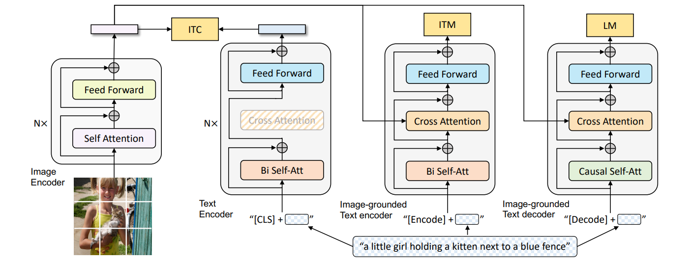
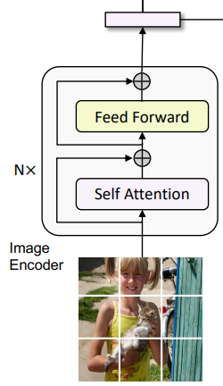
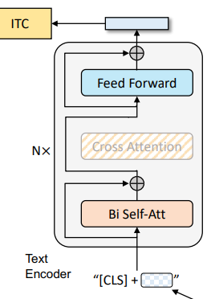
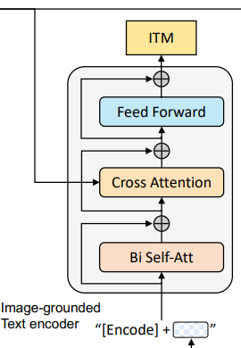
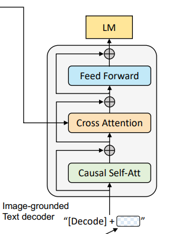
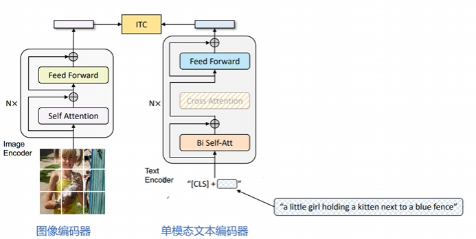
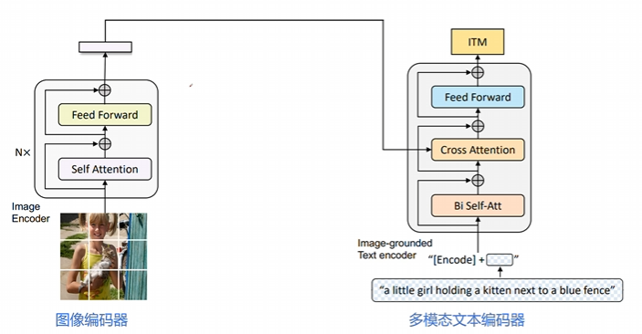
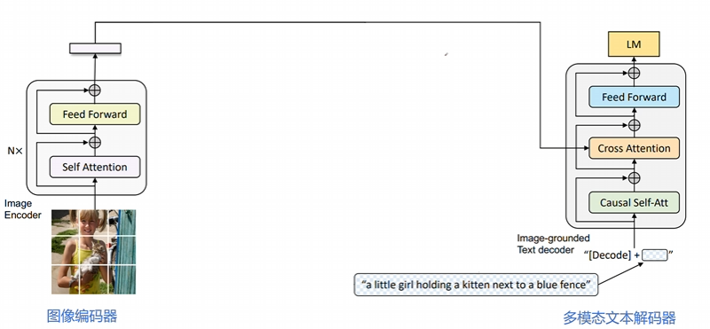
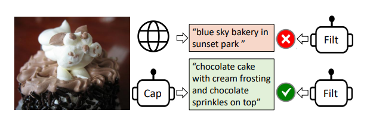
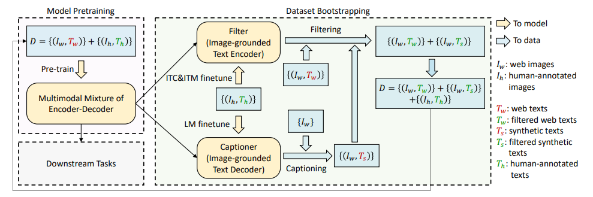

# BLIP: 统一理解和生成的自举多模态模型

Author By: 李佳函

## 引言

### 核心挑战

在 BLIP 提出前，视觉-语言预训练领域已有 CLIP、ALBEF 等代表性工作，但仍存在两个关键瓶颈：

+ 问题一：**任务能力割裂**
  + **架构局限性**。没有一个模型既可以做检索又可以做生成。
    - **Encoder-only 模型**（如 CLIP）：  
    擅长图文检索等理解任务，但无法执行文本生成任务（如图像字幕生成）
    - **Encoder-Decoder 模型**：  
    支持生成任务，但难以有效应用于图像-文本检索任务
  + **根本矛盾**：理解任务需深度跨模态交互，生成任务需自回归建模，传统架构无法同时优化两种目标。
+ 问题二：**数据噪声污染**。过往的这些多模态 SOTA 模型，都是在网络上爬取大量的数据进行预训练的。由于数据量够大，训练效果也差强人意。但这些噪声数据对于模型的训练来说是非常不利的，如果可以提取到更纯净的数据进行训练，模型的性能还可以进一步提升。

### BLIP 的诞生

基于此问题现象，BLIP 诞生了。BLIP 的作者也是 ALBEF 的作者，因此可以在 BLIP 上看到很多 ALBEF 的影子。

该模型的核心思想主要有两个：

1. **论文提出核心架构——多模态混合编码器-解码器（Multimodal Mixture of Encoder-Decoder, MED）采用双流结构设计**，通过共享参数支持三种模式——单模态编码器（对齐全局特征）、跨模态编码器（细粒度匹配）和跨模态解码器（生成描述），联合优化图像-文本对比（ITC）、匹配（ITM）和语言建模（LM）损失，从而统一理解（如检索）与生成（如描述）任务。
2. **数据层面设计 Captioning 和 Filtering（CapFilt）方法**，利用预训练（使用网上获取的有噪声的数据）的 MED 生成合成描述（Captioner 模块）并过滤原始网络文本与合成文本中的噪声（Filter 模块），从噪声数据中提炼高质量训练样本。

## 模型架构设计

### MED

MED 全称为 Multimodal Mixture of Encoder-Decoder，是一个可以完成三个任务的复合型模型。

如图所示，总共有四个模块，从左往右，分别为两个单模态编码器：图像编码器和文本编码器，两个多模态编码器：基于图像的文本编码器和解码器。

#### 图像编码器（Unimodal Image Encoder）

+ 架构：基于 Transformer 的视觉编码器（ViT），将图像划分为固定大小的 patch（如 224×224 分辨率下分割为 14×14 的 196 个 patch），每个 patch 被线性嵌入为向量。
+ 关键设计：
  + 全局特征提取：在输入序列中添加一个特殊的[CLS]标记（Global Image Token），用于捕捉图像的整体语义信息。
  + 动量编码器：在对比学习（ITC 任务）中，引入了 ALBEF 的做法即动量编码器（Momentum Encoder）生成软标签，增强负样本的鲁棒性。
+ 输出：生成图像的嵌入向量序列（包括[CLS]标记的特征），作为后续多模态模块的输入。
> 软标签即为概率值，不是像硬标签那样的非 1 即 0。使用软标签可以让模型学习到更细粒度的语义信息，而不是简单地二值化判断。

#### 文本编码器（Unimodal Text Encoder）

+ 功能：将文本序列编码为上下文感知的特征表示。
+ 架构：基于 BERT 的 Transformer 编码器，对文本进行双向自注意力建模。
+ 关键设计：
  + 文本结构化：在文本开头插入[CLS]标记，用于聚合整个文本的全局信息。
  + 单模态对齐：通过图像-文本对比损失（ITC）与图像编码器的特征空间对齐。
+ 输出：生成文本的嵌入向量序列（包括[CLS]标记的特征），用于图像-文本匹配（ITM）或跨模态交互。

#### 基于图像的文本编码器（Image-Grounded Text Encoder）

+ 功能：融合图像信息与文本信息，生成多模态联合表示。
+ 架构：在标准文本编码器的基础上，插入交叉注意力层（Cross-Attention Layer）。
  + 结构细节：
    + 在每个 Transformer 块的自注意力层（Self-Attention, SA）和前馈网络（FFN）之间，增加一个交叉注意力层（Cross-Attention, CA）。
    + CA 层的作用：以图像编码器的输出作为 query，文本编码器的中间表示作为 key 和 value，实现视觉信息向文本的注入。
  + 任务特定标记：在文本输入中插入一个任务专用的[Encode]标记，其最终输出作为多模态表示的核心。
+ 关键任务：
  + 图像-文本匹配（ITM）：通过二分类头部（ITM Head）判断图像-文本对是否匹配。
  + 多模态检索：生成跨模态嵌入向量，用于图像与文本的相似度计算。

#### 基于图像的文本解码器（Image-Grounded Text Decoder）

+ 功能：以图像为条件生成连贯的文本描述（如图像字幕）。
+ 架构：基于 Transformer 的解码器，采用因果掩码自注意力（Causal Self-Attention），即 decoder 只与之前出现的 token 进行 attention 操作。
  + 结构细节：
    + 替换标准解码器的双向自注意力为因果掩码自注意力，确保生成过程的顺序性（仅依赖历史和当前 token）。
    + 跨模态注意力：在解码器中引入交叉注意力层，直接利用图像编码器的输出作为视觉上下文。
  + 任务特定标记：在文本生成时，使用[Decode]标记作为序列的起始信号。结尾需要添加一个[EOS]字符。
+ 关键任务：
  + 图像条件语言建模（LM）：通过最大化给定图像下文本序列的似然，训练模型生成与图像内容一致的描述。
  + 多任务生成：支持图像描述生成、视觉问答（VQA）等需要生成能力的任务。

### 预训练目标

以上的四个模块，第一个作为图像编码器，另外三个作为文本的编码/解码器，共同组成了三个任务：ITC、ITM、LM。

| 损失函数            | 作用             | 对应模块 |
| :------------------ | :--------------- | :------- |
| ITC（图文对比损失） | 对齐图文特征空间 | 编码器   |
| ITM（图文匹配损失） | 细粒度图文匹配   | 编码器   |
| LM（语言建模损失）  | 生成连贯文本描述 | 解码器   |

具体的模块在上文中有具体讲解，下文中具体介绍任务。

#### 图像编码器+单模态文本编码器：ITC 任务

+ 核心目标：通过对比学习对齐视觉和文本特征空间，使正向图像-文本对的表征更相似，负向对的表征差异更大。
+ 图像端：采用 ViT（Vision Transformer）模型，将输入图像划分为固定大小的 patch（如 224×224 分辨率下分割为 196 个 patch），每个 patch 被线性嵌入为向量。输出包含一个全局图像标记[CLS]的嵌入向量。
+ 文本端：基于 BERT 的 Transformer 编码器，对文本进行双向自注意力建模。在文本开头插入[CLS]标记，用于聚合整个文本的全局信息。输出文本的嵌入向量序列（包括[CLS]标记的特征）。
+ 损失函数：
$$\mathcal{L}_{\mathrm{ITC}}=-\frac{1}{N} \sum_{i=1}^{N}\left[\log \frac{\exp \left(\operatorname{sim}\left(I_{i}, T_{i}\right) / \tau\right)}{\sum_{j=1}^{N} \exp \left(\operatorname{sim}\left(I_{i}, T_{j}\right) / \tau\right)}+\log \frac{\exp \left(\operatorname{sim}\left(T_{i}, I_{i}\right) / \tau\right)}{\sum_{j=1}^{N} \exp \left(\operatorname{sim}\left(T_{i}, I_{j}\right) / \tau\right)}\right]$$

其中：
$I_i$：第 $i$ 个图像的特征向量（通过 ViT 提取的[CLS]标记）。
$T_i$：第 $i$ 个图像的特征向量（通过 BERT 提取的[CLS]标记）。
$sim(⋅,⋅)$：余弦相似度函数。
$τ$：温度参数（通常设为 0.05），用于调整相似度分布的锐度。
该损失函数采用双向对比，分别计算图像到文本和文本到图像的对比损失，并取平均。

#### 图像编码器+多模态文本编码器：ITM 任务

+ 核心目标：学习图像与文本之间的细粒度对齐，判断图像-文本对是否匹配。通过二分类任务区分正样本（匹配）和负样本（不匹配）。
+ 图像端：同样采用 ViT 模型提取图像特征，但需与文本编码器联合计算交叉注意力。输出图像的嵌入向量序列，作为多模态交互的基础。
+ 文本端：基于 BERT 的 Transformer 编码器，在标准自注意力层（SA）和前馈网络（FFN）之间插入交叉注意力层（CA）。通过 CA 层将图像特征注入文本表示，实现视觉信息与文本的细粒度对齐。在文本输入中插入任务专用的[Encode]标记，其最终输出作为多模态表示的核心。
+ 损失函数：
$$\mathcal{L}_{\text {ITM }}=-\frac{1}{N} \sum_{i=1}^{N}\left[y_{i} \log p_{i}+\left(1-y_{i}\right) \log \left(1-p_{i}\right)\right]$$

其中：
$y_i∈ \{0,1\}$：第 $i$ 个图像-文本对的标签（1 表示匹配，0 表示不匹配）。
$p_i$：模型预测的匹配概率，由 ITM 头部（线性分类层）输出。
$N$：当前 batch 的样本数。
该损失函数采用交叉熵损失函数，做二分类任务，确保模型能够区分匹配与不匹配的图像-文本对。

#### 图像编码器+多模态文本解码器：LM 任务

+ 核心目标：基于图像生成连贯的文本描述（如图像字幕）。通过自回归建模，最大化给定图像下文本序列的似然。
+ 图像端：采用 ViT 模型提取图像特征，作为文本生成的上下文条件。输出图像的嵌入向量序列，供解码器直接使用。
+ 文本端：基于 Transformer 的解码器架构，采用因果掩码自注意力（Causal Self-Attention），确保生成过程的顺序性。在文本生成时，使用[Decode]标记作为序列的起始信号。通过交叉注意力层（CA）直接利用图像特征作为视觉上下文，实现图像到文本的连贯生成。
+ 损失函数：
$$\mathcal{L}_{\mathrm{LM}}=-\frac{1}{L}\sum_{t=1}^{L}\log p(t_{t}\mid t_{<t},I)$$

其中：
$t_t$：第 $t$ 个时刻生成的 token（如文本中的第 t 个词）
$t_{<t}$：已经生成的前 $t-1$ 个 token
$I$：输入图像的特征向量（通过 ViT 提取的特征）。
$L$：生成文本的总长度（最大长度或实际长度）。

#### 损失函数的联合优化

BLIP 通过联合优化这三个损失函数，实现多模态理解和生成能力的统一训练：
$$\mathcal{L}_{\mathrm{Total}}=\alpha\mathcal{L}_{\mathrm{ITC}}+\beta\mathcal{L}_{\mathrm{ITM}}+\gamma\mathcal{L}_{\mathrm{LM}}$$
其中，$α,β,γ$ 是权重系数（通常设为 1 或通过实验调整）。

## 数据自举(data Bootstrapping)：CapFilt

CapFilt（Captioning and Filtering）是 BLIP 提出的一种数据清洗与生成的自举机制，旨在解决从网络爬取的图像-文本对中存在噪声的问题。CapFilt 由两部分组成：Captioner（生成器）和 Filter（过滤器）。

### Captioner（生成器）

+ 功能：为图像生成高质量文本描述。

+ 实现方式：
  + 使用图像引导的文本解码器（基于 Transformer 的解码器架构）。
  + 采用因果掩码自注意力（Causal Self-Attention），确保生成过程的顺序性。
+ 训练目标：通过 LM 损失函数，优化生成能力。

### Filter（过滤器）

+ 功能：评估图文对匹配度，过滤掉噪声样本。
+ 实现方式：
  + 使用图像引导的文本编码器（基于 BERT 的编码器架构）。
  + 采用二分类任务（ITM Loss）判断匹配性（1 表示匹配，0 表示不匹配）。
+ 训练目标：通过图文匹配损失（ITM Loss）和对比学习损失（ITC Loss）优化判别能力。

### 工作流程

先来看一个简单的例子。
如图，Captioner 生成的描述为："chocolate cake with cream frosting and chocolate sprinkles on top".
而网络上的文本为："blue sky bakery in sunset park".
通过 Filter，判断出 Captioner 与图片匹配。于是就将原本网络文本对中的文本改变成了新生成的，再进行后续的训练操作。

接下来具体讲解该流程。

1. **初始化阶段**
Captioner 和 Filter 均从预训练的 MED 模型中初始化，确保初始参数具备一定的多模态对齐能力。
1. **数据生成与过滤阶段**
对于网络上爬取的噪声图像，使用**Captioner**生成文本描述（合成文本），同时保留原始网络文本（可能存在噪声）。
将生成的合成文本和网络文本分别输入**Filter**，过滤掉 Filter 认为不匹配的样本。
1. **数据集构建**
将以下三类样本合并，形成新的高质量训练数据集：
   + 人工标注数据（如 COCO）。图片中即 $\{I_h, T_h\}$
   + Filter 筛选后的原始网络数据。图片中即 $\{I_w, T_w\}$
   + Filter 筛选后的合成数据。图片中即 $\{I_w, T_s\}$
1. **迭代优化阶段**
使用新构建的高质量数据集重新训练 BLIP 模型（MED 架构）。重复“生成→过滤→训练”过程，逐步提升模型性能和数据质量。

### 实验结果

在 BLIP 的论文中，CapFilt 机制被验证能够显著提升模型性能：

+ **图像-文本检索**：在 COCO、Flickr30K 等数据集上，CapFilt 使 BLIP 的检索精度（Recall@K）提升 10%-15%。
+ **图像字幕生成**：在 COCO 测试集上，CapFilt 使 BLIP 的 CIDEr 得分提升 8%-12%。
+ **视觉问答**：在 VQA 2.0 数据集上，CapFilt 使 BLIP 的准确率提升 5%-7%。
+ **鲁棒性**：在噪声数据场景下，CapFilt 显著提升了模型对错误文本的容忍能力。
  
| 方法             | 数据来源               | 数据质量 | 训练成本 | 模型性能 |
| :--------------- | :--------------------- | :------- | :------- | :------- |
| 传统方法         | 人工标注数据           | 高       | 高       | 中       |
| 直接使用噪声数据 | 网络爬取数据           | 低       | 低       | 低       |
| CapFilt          | 人工+噪声数据+合成数据 | 高       | 中       | 高       |

## 结语

BLIP 通过**架构创新**、**数据自举**和**任务统一**的设计，重新定义了多模态预训练模型的能力边界。它不仅为视觉-语言任务提供了高效解决方案，还为多模态学习提供了可复用的技术范式。随着 BLIP 系列的持续演进（如 BLIP-2 的 Q-Former 和 BLIP-3-o 的双引擎设计），多模态 AI 正朝着更强大、更通用的方向迈进，为人工智能的“感知-理解-生成”闭环奠定坚实基础。